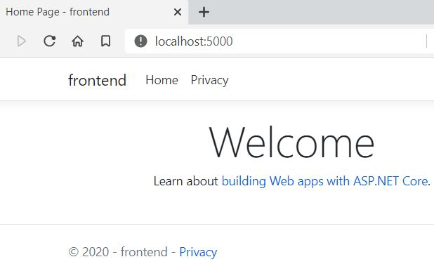
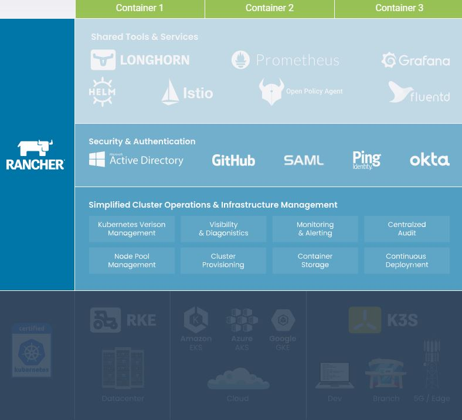

Title: ASP.NET Core with k8s hosting
Status: draft
Date: 2020-10-27 00:00
Modified: 2020-11-09 10:30
Category: Develop
Tags: #csharp, #netcore3, #docker, #k8s, #jq, #vscode

This blog is part of a serie:

* [Part 0.1: Install Docker Desktop on Windows 10 Home - including WSL]({filename}/2020/2020-09-07-Docker4Win20.md)
* [Part 0.2: Install k8s using kind on Windows - including arkade]({filename}/2020/2020-10-12-K8sArkade.md)
* [Part 1.1: Run docker containers]({filename}/2020/2020-10-18-DockerRun.md)
* [Part 1.2: Develop .NET docker images]({filename}/2020/2020-10-25-CsCore3DevDocker.md)
* Part 1.3: Run containers in k8s (this blog)
* Part 2: Deploy containers to Civo

# Intro

This blog is an example of a development cycle developing in C# on Windows using VSCode editor - also for debugging docker containers - and deploying to k8s.  

This blog is inspired by content from an eBook and some tutorials.  
You find its code in this git repo: [rasor/eBook-UsingNETCoreDockerKubernetes](https://github.com/rasor/eBook-UsingNETCoreDockerKubernetes).  

Main Sources are:
* Free eBook (2019): [Syncfusion Free Ebooks | Using .NET Core, Docker, and Kubernetes Succinctly](https://www.syncfusion.com/ebooks/using-netcore-docker-and-kubernetes-succinctly)
  * By [@apomic80](https://twitter.com/apomic80)        
    * Github: [apomic80](https://github.com/apomic80)
* Guide: [Inner-loop development workflow for Docker apps](https://docs.microsoft.com/en-us/dotnet/architecture/containerized-lifecycle/design-develop-containerized-apps/docker-apps-inner-loop-workflow)
  * from free eBook (2020): [Containerized Docker Application Lifecycle with Microsoft Platform and Tools](https://docs.microsoft.com/en-us/dotnet/architecture/containerized-lifecycle/) from Microsoft

# PreRequisites

* Windows 10
* [.NET Core 3.1 SDK](https://dotnet.microsoft.com/download)
* [Git Bash](https://gitforwindows.org/)
* [Visual Studio Code](https://code.visualstudio.com/download)
  * [C# for VSCode](https://marketplace.visualstudio.com/items?itemName=ms-dotnettools.csharp)
* [Docker Desktop for Windows user manual](https://docs.docker.com/docker-for-windows/)
* `k8s` (I am using `kind` for [creating cluster](K8sArkade.md))
* Optional: [choco](https://chocolatey.org/install)
* Optional: [jq](https://stedolan.github.io/jq/download/)
* Optional: [helm](https://helm.sh/)
  * `choco install kubernetes-helm` or `arkade get helm`
* Optional: [draft](https://github.com/Azure/draft/blob/master/docs/quickstart.md)

# Chapters from eBook **Using .NET Core, Docker, and Kubernetes**
## Chapter 1 ASP.NET and Docker Together
### Chapter 1.1 Execute .NET Core application with Docker

See [Part 1.1: Run docker containers]({filename}/2020/2020-10-18-DockerRun.md)

## Chapter 2 Create Your Application with Docker
### Chapter 2.1 Develop your ASP.NET Core application using Docker

See [Part 1.2: Develop .NET docker images]({filename}/2020/2020-10-25-CsCore3DevDocker.md)

## Chapter 3 Deploy Your Application on Kubernetes
### Chapter 3.2 Deploy your images in Kubernetes

I am using `kind` for creating a `k8s` cluster. I did that in [this blog](K8sArkade.md).  

kubectl is a CLI using API to access k8s.  

```bash
# check if k8s cluster is running
kubectl cluster-info
# Unable to connect to the server: dial tcp 127.0.0.1:52295: connectex: No connection could be made

# Check if there are any clusters
$ kind get clusters
# kind

# Check it the container is running
docker ps -a | grep kind
# CONTAINER ID        IMAGE                  COMMAND                  CREATED             STATUS                   PORTS                       NAMES
# 0b9a7220b4f8        kindest/node:v1.19.1   "/usr/local/bin/entr…"   5 weeks ago         Exited (0) 3 weeks ago   127.0.0.1:52295->6443/tcp   kind-control-plane

# start the k8s cluster
docker start kind-control-plane

# check if k8s cluster is running
kubectl cluster-info
# Kubernetes master is running at https://127.0.0.1:52295
# KubeDNS is running at https://127.0.0.1:52295/api/v1/namespaces/kube-system/services/kube-dns:dns/proxy
```

Testing starting the image in a pod manually:
```bash
# Manually start the container in k8s - and never restart it, when it dies - let proxy know that pod should listen to :5000 and give container env-vars.  
kubectl run frontend2 --image=rasor/usingnetcoredockerkubernetes:frontend2-v1 --port=5000 --restart=Never --env="ASPNETCORE_URLS=http://+:5000"
# pod/frontend2 created

kubectl get pods
# NAME        READY   STATUS    RESTARTS   AGE
# frontend2   1/1     Running   0          24s

kubectl describe pod frontend2
# Name:         frontend2
# Namespace:    default
# Priority:     0
# Node:         kind-control-plane/172.18.0.2
# Start Time:   Tue, 27 Oct 2020 12:24:42 +0100
# Labels:       run=frontend2
# Annotations:  <none>
# Status:       Running
# IP:           10.244.0.9
# IPs:
#   IP:  10.244.0.9
# Containers:
#   frontend2:
#     Container ID:   containerd://6134c6c308d49c4c49835009333ca5aaedf18d235712bec49a4ae4fbe9606c12
#     Image:          rasor/usingnetcoredockerkubernetes:frontend2-v1
#     Image ID:       docker.io/rasor/usingnetcoredockerkubernetes@sha256:e413934f1dba2e85b66f69125f6b4ac9944122c8f1c3d8f0f97355abb6ad8ec9       
#     Port:           5000/TCP
#     Host Port:      0/TCP
#     State:          Running
#       Started:      Tue, 27 Oct 2020 12:24:42 +0100
#     Ready:          True
#     Restart Count:  0
#     Environment:    <none>
#     Mounts:
#       /var/run/secrets/kubernetes.io/serviceaccount from default-token-95gtj (ro)
# Conditions:
#   Type              Status
#   Initialized       True
#   Ready             True
#   ContainersReady   True
#   PodScheduled      True
# Volumes:
#   default-token-95gtj:
#     Type:        Secret (a volume populated by a Secret)
#     SecretName:  default-token-95gtj
#     Optional:    false
# QoS Class:       BestEffort
# Node-Selectors:  <none>
# Tolerations:     node.kubernetes.io/not-ready:NoExecute for 300s
#                  node.kubernetes.io/unreachable:NoExecute for 300s
# Events:
#   Type    Reason     Age        From                         Message
#   ----    ------     ----       ----                         -------
#   Normal  Scheduled  <unknown>                               Successfully assigned default/frontend2 to kind-control-plane
#   Normal  Pulled     11s        kubelet, kind-control-plane  Container image "rasor/usingnetcoredockerkubernetes:frontend2-v1" already present 
# on machine
#   Normal  Created    11s        kubelet, kind-control-plane  Created container frontend2
#   Normal  Started    11s        kubelet, kind-control-plane  Started container frontend2

# And what does that mean?
kubectl explain pods

# read all deployed in default namespace
kubectl get all
# NAME            READY   STATUS    RESTARTS   AGE
# pod/frontend2   1/1     Running   0          6m57s

# NAME                 TYPE        CLUSTER-IP   EXTERNAL-IP   PORT(S)   AGE
# service/kubernetes   ClusterIP   10.96.0.1    <none>        443/TCP   38d
```

#### API into k8s

Start proxy in another terminal.  
This gives HTTP access to the k8s API on port 8001  
```bash
kubectl proxy
```
Then open browser http://127.0.0.1:8001/

Try to reach pod via api:
http://127.0.0.1:8001/api/v1/namespaces/default/pods/frontend2/proxy/

Nice - the pod responds with a webpage :-)

```bash
# print stdout from the container
kubectl logs frontend2
#       Storing keys in a directory '/root/.aspnet/DataProtection-Keys' that may not be persisted outside of the container. Protected data will be unavailable when container is destroyed.
#       No XML encryptor configured. Key {d848e8f7-df39-44b3-902c-b11019a1d9ab} may be persisted to storage in unencrypted form.
#       Now listening on: http://[::]:5000
#       Application started. Press Ctrl+C to shut down.
#       Hosting environment: Production
#       Content root path: /app
#       Failed to determine the https port for redirect.
```

Stop the proxy with ctrl-c and instead use port forwarding:
```bash
# Give localhost TCP access from port 5000 to the POD port 5000
kubectl port-forward pod/frontend2 5000:5000
# Forwarding from 127.0.0.1:5000 -> 5000
# Forwarding from [::1]:5000 -> 5000

# browse to pod
start http://localhost:5000
```
  

```bash
# Delete the pod
kubectl delete pod frontend2
# pod "frontend2" deleted
```

Tip:
* [Port-forward also can forward to RS, SVC or Deployment](https://stackoverflow.com/a/51469150/750989)
* [Port-forward also has --address to listen to](https://stackoverflow.com/a/62727416/750989)
* Port-forward tool for local dev: [kubefwd](https://github.com/txn2/kubefwd)

#### UI into k8s

To manage k8s you could use many different apps like
* [Kubernetes VSCode plugin](https://marketplace.visualstudio.com/items?itemName=ms-kubernetes-tools.vscode-kubernetes-tools)
  * Double-click on a resource to see its yaml
  * View helm repos
  * View cloud clusters
* kubernetes-dashboard - just read - install via arkade or from remote yml file
```bash
# install kubernetes-dashboard as a k8s app
kubectl create -f https://raw.githubusercontent.com/kubernetes/dashboard/master/aio/deploy/recommended/kubernetes-dashboard.yaml
# get login token
kubectl -n kube-system get secret
kubectl -n kube-system describe secret deployment-controller-token-?????
kubectl proxy
# paste login token into
start http://localhost:8001/api/v1/namespaces/kubernetes-dashboard/services/https:kubernetes-dashboard:/proxy/#/login
```
* portainer - install via arkade
* [Rancher](https://rancher.com/quick-start/)
  * `docker run -d --restart=unless-stopped -p 80:80 -p 443:443 rancher/rancher`
* [Kubernetic](https://www.kubernetic.com/)

  
(_Image from Rancher_)

#### Declare your infrastructure using yaml

To define managed k8s infrastructure you write k8s yaml.  
Install [Kubernetes Support](https://marketplace.visualstudio.com/items?itemName=ipedrazas.kubernetes-snippets) in VSCode.  
This will provide you with snippets for pods, services, deployments, etc.  

Now create a new file called `k8s-deploy-dev.yml`
* Write `kind: De` then 
* Press ctrl-space and select a Deployment template.   

With yml created you `create` or `apply` the file using `-f`.  
When you `apply` k8s will create-if-not-exist or change-if-not-correct.  
If you `create` you should `create --save-config`. Create will throw error, if resource exists.  
[Read more...](https://stackoverflow.com/a/54248723/750989)

These are the resources you can create (with the snippets):
```text
clusterrole         - Create a ClusterRole.
clusterrolebinding  - Create a ClusterRoleBinding for a particular ClusterRole
configmap           - Create a configmap from a local file, directory or literal value
cronjob             - Create a cronjob with the specified name.
deployment          - Create a deployment with the specified name.
job                 - Create a job with the specified name.
namespace           - Create a namespace with the specified name
poddisruptionbudget - Create a pod disruption budget with the specified name.
priorityclass       - Create a priorityclass with the specified name.
quota               - Create a quota with the specified name.
role                - Create a role with single rule.
rolebinding         - Create a RoleBinding for a particular Role or ClusterRole
secret              - Create a secret using specified subcommand
service             - Create a service using specified subcommand.
serviceaccount      - Create a service account with the specified name
```

Besides those above snippets you can find `C#` helm chart templates for
* [deployment](https://github.com/Azure/draft/blob/master/packs/csharp/charts/templates/deployment.yaml)
* [ingress](https://github.com/Azure/draft/blob/master/packs/csharp/charts/templates/ingress.yaml)
* [service](https://github.com/Azure/draft/blob/master/packs/csharp/charts/templates/service.yaml)
... used by the k8s App builder tool [Draft](https://github.com/Azure/draft/blob/master/docs/quickstart.md).  
Note: draft is not yet upgraded to core 3.1, but is using core 2.1. The project is archieved!  

You can also just grap the whole yaml from this blog: [Build ASP.NET Core applications deployed as Linux containers into AKS/Kubernetes clusters](https://docs.microsoft.com/en-us/dotnet/architecture/containerized-lifecycle/design-develop-containerized-apps/build-aspnet-core-applications-linux-containers-aks-kubernetes#deploy-webappyml)  
and correct then names.  

You can print all resource types with  
`kubectl api-resources --sort-by=kind`  
They are
```text
NAME                              SHORTNAMES   APIGROUP                       NAMESPACED   KIND
bindings                                                                      true         Binding
componentstatuses                 cs                                          false        ComponentStatus
configmaps                        cm                                          true         ConfigMap
endpoints                         ep                                          true         Endpoints
limitranges                       limits                                      true         LimitRange
namespaces                        ns                                          false        Namespace
nodes                             no                                          false        Node
persistentvolumes                 pv                                          false        PersistentVolume
persistentvolumeclaims            pvc                                         true         PersistentVolumeClaim
pods                              po                                          true         Pod
podtemplates                                                                  true         PodTemplate
replicationcontrollers            rc                                          true         ReplicationController
resourcequotas                    quota                                       true         ResourceQuota
secrets                                                                       true         Secret
services                          svc                                         true         Service
serviceaccounts                   sa                                          true         ServiceAccount

mutatingwebhookconfigurations                  admissionregistration.k8s.io   false        MutatingWebhookConfiguration
validatingwebhookconfigurations                admissionregistration.k8s.io   false        ValidatingWebhookConfiguration
customresourcedefinitions         crd,crds     apiextensions.k8s.io           false        CustomResourceDefinition
apiservices                                    apiregistration.k8s.io         false        APIService
controllerrevisions                            apps                           true         ControllerRevision
daemonsets                        ds           apps                           true         DaemonSet
deployments                       deploy       apps                           true         Deployment
replicasets                       rs           apps                           true         ReplicaSet
statefulsets                      sts          apps                           true         StatefulSet
tokenreviews                                   authentication.k8s.io          false        TokenReview
selfsubjectaccessreviews                       authorization.k8s.io           false        SelfSubjectAccessReview
selfsubjectrulesreviews                        authorization.k8s.io           false        SelfSubjectRulesReview
subjectaccessreviews                           authorization.k8s.io           false        SubjectAccessReview
localsubjectaccessreviews                      authorization.k8s.io           true         LocalSubjectAccessReview
horizontalpodautoscalers          hpa          autoscaling                    true         HorizontalPodAutoscaler
cronjobs                          cj           batch                          true         CronJob
jobs                                           batch                          true         Job
certificatesigningrequests        csr          certificates.k8s.io            false        CertificateSigningRequest
leases                                         coordination.k8s.io            true         Lease
endpointslices                                 discovery.k8s.io               true         EndpointSlice
events                            ev           events.k8s.io                  true         Event
nodes                                          metrics.k8s.io                 false        NodeMetrics
pods                                           metrics.k8s.io                 true         PodMetrics
ingresses                         ing          networking.k8s.io              true         Ingress
ingressclasses                                 networking.k8s.io              false        IngressClass
networkpolicies                   netpol       networking.k8s.io              true         NetworkPolicy
runtimeclasses                                 node.k8s.io                    false        RuntimeClass
poddisruptionbudgets              pdb          policy                         true         PodDisruptionBudget
podsecuritypolicies               psp          policy                         false        PodSecurityPolicy
clusterroles                                   rbac.authorization.k8s.io      false        ClusterRole
clusterrolebindings                            rbac.authorization.k8s.io      false        ClusterRoleBinding
roles                                          rbac.authorization.k8s.io      true         Role
rolebindings                                   rbac.authorization.k8s.io      true         RoleBinding
priorityclasses                   pc           scheduling.k8s.io              false        PriorityClass
csidrivers                                     storage.k8s.io                 false        CSIDriver
csinodes                                       storage.k8s.io                 false        CSINode
storageclasses                    sc           storage.k8s.io                 false        StorageClass
volumeattachments                              storage.k8s.io                 false        VolumeAttachment
```

With the yaml in place you can now `create` or `apply` it:
```bash
# deploy image to k8s
kubectl create -f k8s-deploy-dev.yml
# deployment.apps/frontend2 created
# service/frontend2 created

# print
kubectl get services | grep frontend2
# NAME         TYPE           CLUSTER-IP      EXTERNAL-IP   PORT(S)          AGE
# frontend2    LoadBalancer   10.106.254.38   <pending>     5000:30300/TCP   53s

# remove service
kubectl delete service frontend2
# service "frontend2" deleted

# remove replicaset, pod and deployment
kubectl delete deployment frontend2
# deployment.apps "frontend2" deleted


```


```bash
kubectl port-forward svc/frontend2 5000:5000
# Forwarding from 127.0.0.1:5000 -> 5000
# Forwarding from [::1]:5000 -> 5000
# Handling connection for 5000
```
```bash
```
```bash
```
```bash
```
```bash
# stop the k8s cluster
docker stop kind-control-plane
```

# REFs

* [Kubectl Reference Docs](https://kubernetes.io/docs/reference/generated/kubectl/kubectl-commands)
* Using VSCode: [Inner-loop development workflow for Docker apps](https://docs.microsoft.com/en-us/dotnet/architecture/containerized-lifecycle/design-develop-containerized-apps/docker-apps-inner-loop-workflow)
* Using Visual Studio: [Development workflow for Docker apps](https://docs.microsoft.com/en-us/dotnet/architecture/microservices/docker-application-development-process/docker-app-development-workflow)
* [Debug an app running in a Docker container](https://code.visualstudio.com/docs/containers/debug-common)
* Debug using launch.json: [OmniSharp/omnisharp-vscode](https://github.com/OmniSharp/omnisharp-vscode/blob/master/debugger-launchjson.md)
* tasks.json: [Build and run an ASP.NET Core app in a container](https://code.visualstudio.com/docs/containers/quickstart-aspnet-core)
* tasks.json: [Tasks in Visual Studio Code](https://code.visualstudio.com/docs/editor/tasks)
* Dockerfile: [Setting Default Docker Environment Variables During Image Build](https://vsupalov.com/docker-build-time-env-values/)
* Change entry point: [Containerize an app with Docker tutorial - .NET Core](https://docs.microsoft.com/en-us/dotnet/core/docker/build-container?tabs=linux#change-the-entrypoint)
* k8s: [DevOps with Kubernetes and VSTS: Part 1](https://colinsalmcorner.com/devops-with-kubernetes-and-vsts-part-1/)
* AKS: [Deploy to Azure Kubernetes Service (AKS)](https://docs.microsoft.com/en-us/dotnet/architecture/containerized-lifecycle/design-develop-containerized-apps/deploy-azure-kubernetes-service)
* Using VS - AKS: [Build ASP.NET Core applications deployed as Linux containers into AKS/Kubernetes clusters](https://docs.microsoft.com/en-us/dotnet/architecture/containerized-lifecycle/design-develop-containerized-apps/build-aspnet-core-applications-linux-containers-aks-kubernetes)
* Program.cs [Generic Host Builder in ASP .NET Core 3.1](https://wakeupandcode.com/generic-host-builder-in-asp-net-core-3-1/)

The End
