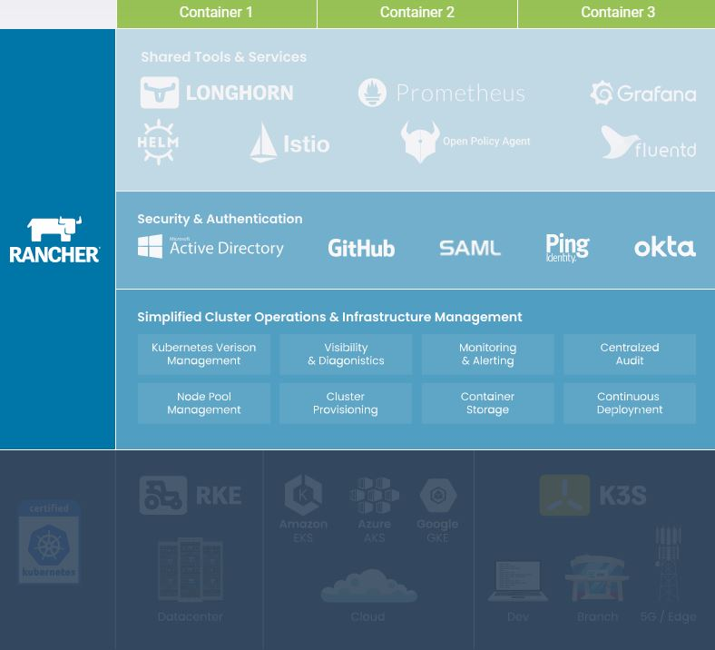

Title: ASP.NET Core with k8s hosting
Date: 2099-01-01 00:00
Category: Develop
Tags: #csharp, #netcore3, #docker, #k8s, #jq, #vscode

# Intro

This blog is an example of a development cycle developing in C# on Windows using VSCode editor - also for debugging docker containers - and deploying to k8s.  

This blog is inspired by content from an eBook and some tutorials.  
You find its code in this git repo: [rasor/eBook-UsingNETCoreDockerKubernetes](https://github.com/rasor/eBook-UsingNETCoreDockerKubernetes).  

Main Sources are:
* Free eBook (2019): [Syncfusion Free Ebooks | Using .NET Core, Docker, and Kubernetes Succinctly](https://www.syncfusion.com/ebooks/using-netcore-docker-and-kubernetes-succinctly)
  * By [@apomic80](https://twitter.com/apomic80)        
    * Github: [apomic80](https://github.com/apomic80)
* Guide: [Inner-loop development workflow for Docker apps](https://docs.microsoft.com/en-us/dotnet/architecture/containerized-lifecycle/design-develop-containerized-apps/docker-apps-inner-loop-workflow)
  * from free eBook (2020): [Containerized Docker Application Lifecycle with Microsoft Platform and Tools](https://docs.microsoft.com/en-us/dotnet/architecture/containerized-lifecycle/) from Microsoft

# PreRequisites

* Windows 10
* [.NET Core 3.1 SDK](https://dotnet.microsoft.com/download)
* [Git Bash](https://gitforwindows.org/)
* [Visual Studio Code](https://code.visualstudio.com/download)
  * [C# for VSCode](https://marketplace.visualstudio.com/items?itemName=ms-dotnettools.csharp)
* [Docker Desktop for Windows user manual](https://docs.docker.com/docker-for-windows/)
* `k8s` (I am using `kind` for [creating cluster](K8sArkade.md))
* Optional: [jq](https://stedolan.github.io/jq/download/)

# Chapters from eBook **Using .NET Core, Docker, and Kubernetes**
## Chapter 1 ASP.NET and Docker Together
### Chapter 1.1 Execute .NET Core application with Docker

Install and start Docker.  
Then open a shell.  

```bash
# Verify docker CLI is installed
docker --version
# Docker version 19.03.13, build 4484c46d9d

# View docker images cached on your machine
docker image ls
# or
docker images
# REPOSITORY          TAG                 IMAGE ID            CREATED             SIZE
```

Now we'll run a console app.
```bash
# pull specific images into your cache
docker pull microsoft/dotnet-samples # this is a console app
docker images
# REPOSITORY                 TAG                 IMAGE ID            CREATED             SIZE
# microsoft/dotnet-samples   latest              70e25069fca7        20 months ago       181MB

# start an image
docker run --name consoleapp 70e25069fca7
#    Hello from .NET Core!

# Which containers are running?
docker ps
# CONTAINER ID        IMAGE               COMMAND             CREATED             STATUS              PORTS               NAMES
# none - the above one fineshed and exited

# show all containers
docker ps -a
# CONTAINER ID        IMAGE                  COMMAND                  CREATED             STATUS                     PORTS                       NAMES
# a51691a1650f        70e25069fca7           "dotnet dotnetapp.dll"   3 minutes ago       Exited (0) 3 minutes ago                               consoleapp

# run again - to avoid creating more images
docker start consoleapp # runs in background by default, so you won't see print here - instead do
docker start consoleapp -i # interactive mode

# remove the image
docker rm consoleapp # by name
# or
docker rm a51691a1650f # by id
```

Next we'll run a web app.  
```bash
# Terminal 1:
# pull a web app
docker pull microsoft/dotnet-samples:aspnetapp # this is a web app
docker images
# REPOSITORY                 TAG                 IMAGE ID            CREATED             SIZE
# microsoft/dotnet-samples   aspnetapp           575d85b4a69b        20 months ago       263MB
# microsoft/dotnet-samples   latest              70e25069fca7        20 months ago       181MB

# start a new image
docker run --name mvcapp 575d85b4a69b # you can add -d to run in damon/background mode, which gives you the prompt back, but you then won't see its outputs
# Hosting environment: Production
# Content root path: /app
# Now listening on: http://[::]:80
# Application started. Press Ctrl+C to shut down.
```
```bash
# Terminal 2:
docker ps
# CONTAINER ID        IMAGE                  COMMAND                  CREATED             STATUS                   PORTS                       NAMES
# 82225a6f9672        575d85b4a69b           "dotnet aspnetapp.dll"   36 seconds ago      Up 34 seconds                                        mvcapp
```

But you can't access it on http://[::]:80 ... You have to redirect an outer port into its port 80.
```bash
# Terminal 1:
# stop the image
docker stop mvcapp # notice - stopping by name
# remove image
docker rm mvcapp

# start the image with access from port 8080 
docker run -p 8080:80 --name mvcapp 575d85b4a69b  # notice - starting by name, so we don't add yet an image
#or
docker create -p 8080:80 --name mvcapp 575d85b4a69b
docker start mvcapp # runs in background by default - use -i to see its outputs
```
```bash
# Terminal 2:
# open browser
start http://localhost:8080
docker ps
# CONTAINER ID        IMAGE                  COMMAND                  CREATED             STATUS                   PORTS                       NAMES
# bab98369a976        575d85b4a69b           "dotnet aspnetapp.dll"   45 seconds ago      Up 43 seconds            0.0.0.0:8080->80/tcp        mvcapp
```
```bash
# Terminal 1:
# stop the image
docker stop mvcapp # notice - stopping by name
# remove image
docker rm mvcapp
```

## Chapter 2 Create Your Application with Docker
### Chapter 2.1 Develop your ASP.NET Core application using Docker

Dotnet core commands:

* dotnet new: Creates a new project from the specified template. If you want to create an MVC application, you can use dotnet new mvc.
* dotnet restore: Restores all the NuGet dependencies of our application.
* dotnet build: Builds our project.
* dotnet run: Executes our project.
* dotnet watch run: Runs our project and watches for file changes to rebuild and re-run it.
* dotnet publish: Creates a deployable build (the .dll) of our project.

Install VSCode plugin [Docker](https://marketplace.visualstudio.com/items?itemName=ms-azuretools.vscode-docker)

```bash
# Terminal 1:
# Create a C# gitignore file in the root
dotnet new gitignore

# create a folder for MVC frontend
mkdir -p cpt2/frontend
cd cpt2/frontend
# Create mvc web
dotnet new mvc

# Build an run a webserver
dotnet build
dotnet run
```
```bash
# Terminal 2:
# open a browser
start https://localhost:5001/
```
Stop the webserver in Teminal 1 with ctrl-c.  

Now create `.vscode` files `launch.json` and `tasks.json`:  
* Ctrl-shft-p # to open cmd palette
* `.NET: Generate Assets for Build and Debug`
    * Choose `ASPNET Core`, `linux` container and ports `5000, 5001`

You can now goto **RUN** pane with `ctrl-shft-d`, select the `.NET Core Launch (web)` config and press run.    
In the Debug console you will see
```bash
# Debug console
# Using launch settings from 'C:\Users\zzz\eBook-UsingNETCoreDockerKubernetes/cpt2/frontend\Properties\launchSettings.json' [Profile 'frontend']...
# Loaded 'C:\Users\zzz\eBook-UsingNETCoreDockerKubernetes\cpt2\frontend\bin\Debug\netcoreapp3.1\frontend.dll'. Symbols loaded.
# .....
```
You can hit breakpoints.  

Now create a `Dockerfile`, `.dockerignore` and `docker-compose.yml`:  
* In explorer put cursor on cpt2\frontend
* Ctrl-shft-p # to open cmd palette
* `Docker: Add Docker files to workspace`
    * Choose `ASPNET Core`, `linux` container and ports `5000, 5001`, `yes` to create compose file
      
    _(Img from Microsoft) Add Dockerfile in VSCode_


```dockerfile
# Generated Dockerfile
# 1. Target img to deploy to
FROM mcr.microsoft.com/dotnet/core/aspnet:3.1 AS base
WORKDIR /app
EXPOSE 5000
EXPOSE 5001

# 5. Source img to build on
FROM mcr.microsoft.com/dotnet/core/sdk:3.1 AS build
WORKDIR /src
# 7. Copy project file from local pc into Source img
COPY ["cpt2/frontend/frontend.csproj", "cpt2/frontend/"]
RUN dotnet restore "cpt2/frontend/frontend.csproj"
COPY . .
WORKDIR "/src/cpt2/frontend"
# 11. Build .dll
RUN dotnet build "frontend.csproj" -c Release -o /app/build

FROM build AS publish
# 13. Create a deployable package
RUN dotnet publish "frontend.csproj" -c Release -o /app/publish

FROM base AS final
WORKDIR /app
# 16. Copy from Source img to Target img
COPY --from=publish /app/publish .
# 17. Define start command
ENTRYPOINT ["dotnet", "frontend.dll"]
```

Change cmd 7 to 10, so you'll be able to `docker build` from inside folder `cpt2/frontend`

```dockerfile
# 7. Copy project file from local pc into Source img
COPY ./frontend.csproj .
RUN dotnet restore frontend.csproj
COPY . .
WORKDIR /src
```

* [Dockerfile reference](https://docs.docker.com/engine/reference/builder/)

Let's build our docker img

```bash
# verify docker is running
docker images
# goto folder with Dockerfile
cd cpt2/frontend
docker build --help
# build img and tag it frontend2
docker build -t frontend2 .

# System.InvalidOperationException: Unable to configure HTTPS endpoint. No server certificate was specified, and the default developer certificate could not be found or is out of date.


# Sending build context to Docker daemon  6.432MB
# Step 1/17 : FROM mcr.microsoft.com/dotnet/core/aspnet:3.1 AS base
# 3.1: Pulling from dotnet/core/aspnet
# bb79b6b2107f: Pull complete
# fd6f53cfcb35: Pull complete
# 29b35ed07a14: Pull complete
# fd068c4127c7: Pull complete
# dc51486f316e: Pull complete
# Digest: sha256:4030ec40f9b5c1e8cac5d550639b7b05d1d6af0c89b4b47d66bad7f93379c9eb
# Status: Downloaded newer image for mcr.microsoft.com/dotnet/core/aspnet:3.1
#  ---> e3559b2d50bb
# Step 2/17 : WORKDIR /app
#  ---> Running in 14fd02991c3d
# Removing intermediate container 14fd02991c3d
#  ---> df46b5f3b46a
# Step 3/17 : EXPOSE 5000
#  ---> Running in 5adf5a71198d
# Removing intermediate container 5adf5a71198d
#  ---> 817df2c51839
# Step 4/17 : EXPOSE 5001
#  ---> Running in 1815541a6c6a
# Removing intermediate container 1815541a6c6a
#  ---> 02891abd8059
# Step 5/17 : FROM mcr.microsoft.com/dotnet/core/sdk:3.1 AS build
# 3.1: Pulling from dotnet/core/sdk
# e4c3d3e4f7b0: Pull complete
# 101c41d0463b: Pull complete
# 8275efcd805f: Pull complete
# 751620502a7a: Pull complete
# 8e306865fd07: Pull complete
# 9d2f53e752c2: Pull complete
# 143a93e01eba: Pull complete
# Digest: sha256:d09eefeaad2129f0a0ac047095792afc6792e7aae4b8bb1c1fa5b6650caae240
# Status: Downloaded newer image for mcr.microsoft.com/dotnet/core/sdk:3.1
#  ---> 5fe503d51830
# Step 6/17 : WORKDIR /src
#  ---> Running in 143a136929b6
# Removing intermediate container 143a136929b6
#  ---> 0e5a8185b7a2
# Step 7/17 : COPY ./frontend.csproj .
#  ---> 203c96e3d357
# Step 8/17 : RUN dotnet restore frontend.csproj
#  ---> Running in cd917bface5b
#   Determining projects to restore...
#   Restored /src/frontend.csproj (in 170 ms).
# Removing intermediate container cd917bface5b
#  ---> 866543516985
# Step 9/17 : COPY . .
#  ---> 6ac6636b092c
# Step 10/17 : WORKDIR /src
#  ---> Running in 40c27a3098f1
# Removing intermediate container 40c27a3098f1
#  ---> d3f07b018611
# Step 11/17 : RUN dotnet build "frontend.csproj" -c Release -o /app/build
#  ---> Running in 56cc1964bf83
# Microsoft (R) Build Engine version 16.7.0+7fb82e5b2 for .NET
# Copyright (C) Microsoft Corporation. All rights reserved.
#   Determining projects to restore...
#   Restored /src/frontend.csproj (in 185 ms).
#   frontend -> /app/build/frontend.dll
#   frontend -> /app/build/frontend.Views.dll
# Build succeeded.
#     0 Warning(s)
#     0 Error(s)
# Time Elapsed 00:00:05.03
# Removing intermediate container 56cc1964bf83
#  ---> 7ccf08805a5b
# Step 12/17 : FROM build AS publish
#  ---> 7ccf08805a5b
# Step 13/17 : RUN dotnet publish "frontend.csproj" -c Release -o /app/publish
#  ---> Running in 27507652111d
# Microsoft (R) Build Engine version 16.7.0+7fb82e5b2 for .NET
# Copyright (C) Microsoft Corporation. All rights reserved.
#   Determining projects to restore...
#   All projects are up-to-date for restore.
#   frontend -> /src/bin/Release/netcoreapp3.1/frontend.dll
#   frontend -> /src/bin/Release/netcoreapp3.1/frontend.Views.dll
#   frontend -> /app/publish/
# Removing intermediate container 27507652111d
#  ---> c08c7122d789
# Step 14/17 : FROM base AS final
#  ---> 02891abd8059
# Step 15/17 : WORKDIR /app
#  ---> Running in b52e89be9e92
# Removing intermediate container b52e89be9e92
#  ---> 97d3ac799145
# Step 16/17 : COPY --from=publish /app/publish .
#  ---> 2ac048ea1f90
# Step 17/17 : ENTRYPOINT ["dotnet", "frontend.dll"]
#  ---> Running in 7359a524012b
# Removing intermediate container 7359a524012b
#  ---> f7828ef4f47e
# Successfully built f7828ef4f47e
# Successfully tagged frontend2:latest
# SECURITY WARNING: You are building a Docker image from Windows against a non-Windows Docker host. All files and directories added to build context will have 
# '-rwxr-xr-x' permissions. It is recommended to double check and reset permissions for sensitive files and directories.

# Print image
docker images
# REPOSITORY                             TAG                 IMAGE ID            CREATED             SIZE  
# frontend2                              latest              f7828ef4f47e        5 minutes ago       212MB 
# mcr.microsoft.com/dotnet/core/aspnet   3.1                 e3559b2d50bb        7 days ago          207MB 
# mcr.microsoft.com/dotnet/core/sdk      3.1                 5fe503d51830        7 days ago          708MB 

# Test run the img
docker run -p 5000:5000 --name nfrontend2 -t frontend2 -e "ASPNETCORE_URLS=http://+:5000"
#docker run -p 5000:5000 -p 5001:5001 --name nfrontend2 -t frontend2
#docker create -p 5000:5000 -p 5001:5001 --name nfrontend2 -t frontend2 --entrypoint 'dotnet dev-certs https && # warn: Microsoft.AspNetCore.DataProtection.Repositories.FileSystemXmlRepository[60]
#       Storing keys in a directory '/root/.aspnet/DataProtection-Keys' that may not be persisted outside of the container. Protected data will be unavailable 
# when container is destroyed.
#       No XML encryptor configured. Key {22010cbd-95fa-4543-9ae3-63ee61afff7f} may be persisted to storage in unencrypted form.
#       Now listening on: http://[::]:80
#       Application started. Press Ctrl+C to shut down.
#       Hosting environment: Production
#       Content root path: /app
```

```bash
# Terminal 2:
docker start nfrontend2
# Which containers are running?
docker ps
# CONTAINER ID        IMAGE               COMMAND                 CREATED             STATUS              PORTS                              NAMES
# 6fc16e63dbd5        frontend2           "dotnet frontend.dll"   18 seconds ago      Up 17 seconds       0.0.0.0:5000-5001->5000-5001/tcp   nfrontend2   

# Print entry point
docker ps -a --format "table {{.Image}}:\t {{.Command}}" --no-trunc
# IMAGE:                   COMMAND
# frontend2:               "dotnet frontend.dll…"

# Print as json
docker ps -a --format " {{json .}}" | jq '{ID, Image, Command}'

# Open browser
start http://localhost:5000

# Cleanup
docker stop nfrontend2
docker rm nfrontend2
# Cleanup done?
docker ps -a
```

### Chapter 2.1B (not in eBook) Debug your docker container

To be able to debug on port 5000 you need to do a change in the launcsetting:

Before:
```jsonc
// .vscode/tasks.json
            "label": "docker-run: debug",
            "dependsOn": [
                "docker-build: debug"
            ],
            "dockerRun": {},
```
After:
```jsonc
// .vscode/tasks.json
            "label": "docker-run: debug",
            "dependsOn": [
                "docker-build: debug"
            ],
            "dockerRun": {
                "env": {
                    "ASPNETCORE_URLS": "https://+:5001;http://+:5000"
                },
                "ports": [
                    { "hostPort": 5000, "containerPort": 5000 },
                    { "hostPort": 5001, "containerPort": 5001 }
                ]
            },
```

If you goto **RUN** pane and choose `Docker .NET Core Launch` in the dropdown and then press the "Play" button then you can place breakpoints in your code and remote debug into your container. VSCode will show this:

```bash
#> Executing task: docker-build: debug <

docker build --rm --pull -f "C:\Users\zzz\eBook-UsingNETCoreDockerKubernetes/cpt2/frontend/Dockerfile" --label "com.microsoft.created-by=visual-studio-code" -t "ebookusingnetcoredockerkubernetes:dev" --target "base" "C:\Users\zzz\eBook-UsingNETCoreDockerKubernetes"

# Where
# -f, --file string         Name of the Dockerfile (Default is 'PATH/Dockerfile')
# --label list              Set metadata for an image
# --pull                    Always attempt to pull a newer version of the image
# --rm                      Remove intermediate containers after a successful build (default true)
# -t, --tag list            Name and optionally a tag in the 'name:tag' format
# --target string           Set the target build stage to build.

#> Executing task: docker-run: debug <

docker run -dt -P --name "ebookusingnetcoredockerkubernetes-dev" -e "DOTNET_USE_POLLING_FILE_WATCHER=1" -e "ASPNETCORE_ENVIRONMENT=Development" -e "ASPNETCORE_URLS=https://+:5001;http://+:5000" --label "com.microsoft.created-by=visual-studio-code" -v "C:\Users\zzz\eBook-UsingNETCoreDockerKubernetes/cpt2/frontend:/app:rw" -v "c:\Users\zzz\eBook-UsingNETCoreDockerKubernetes:/src:rw" -v "C:\Users\zzz\.vsdbg:/remote_debugger:ro" -v "C:\Users\zzz\.nuget\packages:/root/.nuget/packages:ro" -v "C:\Program Files\dotnet\sdk\NuGetFallbackFolder:/root/.nuget/fallbackpackages:ro" -v "C:\Users\zzz\AppData\Roaming\Microsoft\UserSecrets:/root/.microsoft/usersecrets:ro" -v "C:\Users\zzz\AppData\Roaming\ASP.NET\Https:/root/.aspnet/https:ro" -p "5000:5000" -p "5001:5001" "ebookusingnetcoredockerkubernetes:dev"

# Where
# -d, --detach                         Run container in background and print container ID
# -t, --tty                            Allocate a pseudo-TTY
# -l, --label list                     Set meta data on a container
# -P, --publish-all                    Publish all exposed ports to random ports
# -v, --volume list                    Bind mount a volume
# Some from tasks.json:
# -e, --env list                       Set environment variables
# -p, --publish list                   Publish a container's port(s) to the host

```

Isn't that nice?

* Ref: [Debug an app running in a Docker container](https://code.visualstudio.com/docs/containers/debug-common)

### Chapter 2.2 Add containers to your project

_To Be Added_

### Chapter 2.3 Run your container with Docker Compose

When you used Command Palette command `Docker: Add Docker files to workspace` then you said yes to create compose files:

```yaml
# Generated docker-compose.debug.yml
# Please refer https://aka.ms/HTTPSinContainer on how to setup an https developer certificate for your ASP .NET Core service.

version: '3.4'

services:
  frontend:
    image: frontend
    build:
      context: .
      dockerfile: cpt2/frontend/Dockerfile
    ports:
      - 5000
      - 5001
    environment:
      - ASPNETCORE_ENVIRONMENT=Development
      - ASPNETCORE_URLS=http://+:5000
    volumes:
      - ~/.vsdbg:/remote_debugger:rw
```

Change frontend in both the .debug.yml and then non-debug yml to:

```yaml
  frontend:
    image: frontend2
    # Add this
    container_name: frontend2 # then you can attach to this name
    build:
      context: ./cpt2/frontend
      dockerfile: Dockerfile
    environment:
    # Add this to the non-debug
      - ASPNETCORE_URLS=https://+:5001;http://+:5000
```

So now we can start several containers at once (if more containeres were present in the compose file).  
Compose will also create a docker network for the containers to communicate through.  

```bash
# ensure you find the root folder
cd cpt2/frontend
# go back to root, where docker-compose.yml exists
cd ../..

docker-compose up

start http://localhost:5000

# ctrl-c to stop the servers
# or
docker-compose stop
# or
docker-compose down # will also remove (docker-compose rm)

# check which containers exists
docker ps -a

# then restart # if not removed
docker-compose start
```

* Refs: 
    * [Overview of docker-compose CLI](https://docs.docker.com/compose/reference/overview/)

Can we debug code running in a container by attiching our local code to it?

* Goto the **RUN** pane
* In the Run-dropdown - do `Àdd Confuguration`
* Choose `Docker .NET Core Attach (Preview)`

This will create most of this

```json
//.vscode/launch.json
    {
        "name": "Docker .NET Core Attach (Preview)",
        "type": "docker",
        "request": "attach",
        "containerName": "frontend2",
        "platform": "netCore",
        "sourceFileMap": {
            "/src": "${workspaceFolder}"
        },
    },
```

Optionally add `containerName` in or to auto attach to a specific running container.  

Now spin up the container
```bash
# use debug compose file
docker-compose -f docker-compose.debug.yml up
```

That will show in a docker terminal:
```bash
# Docker terminal
# > Executing task: docker-compose -f "docker-compose.debug.yml" up -d --build <

# Creating network "ebook-usingnetcoredockerkubernetes_default" with the default driver
# Building frontend
# Step 1/17 : FROM mcr.microsoft.com/dotnet/core/aspnet:3.1 AS base
#  ---> e3559b2d50bb
# ......
# Step 17/17 : ENTRYPOINT ["dotnet", "frontend.dll"]
#  ---> Using cache
#  ---> 6572076fad45

# Successfully built 6572076fad45
# Successfully tagged frontend2:latest
# Creating frontend2 ... done
```

Now in the **RUN** pane select the `Docker .NET Core Attach (Preview)` config and press run.  
In the Debug console you will see
```bash
# Debug console
# Starting: "docker" exec -i frontend2 /remote_debugger/vsdbg --interpreter=vscode
# .....
# Loaded '/app/frontend.dll'. Symbols loaded.
# .....
```

You should be able to set breakpoints in your code and break.  
But something is not quite right, yet. It does not work on my PC.  

* Refs: 
    * [Use Docker Compose to work with multiple containers](https://code.visualstudio.com/docs/containers/docker-compose)
        * Debug NetCore: [NetCore](https://code.visualstudio.com/docs/containers/docker-compose#_net)
    * [Attach to a running container using Visual Studio Code Remote Development](https://code.visualstudio.com/docs/remote/attach-container)

### Chapter 2.4 Create the final image for publication
#### Publish image to docker hub

Create a docker hub repo. I'll publish to  
https://hub.docker.com/repository/docker/rasor/usingnetcoredockerkubernetes 

```bash
# goto folder with Dockerfile
cd cpt2/frontend
docker build --help
# build img and tag it
docker build -t frontend2:v1 .
# Successfully built 6572076fad45
# Successfully tagged frontend2:v1

docker images | grep frontend2
# frontend2                              latest              6572076fad45        3 days ago          212MB
# frontend2                              v1                  6572076fad45        3 days ago          212MB

# tag the image, so you can upload it to docker hub
# docker tag local-image:tagname new-repo:tagname
docker tag frontend2:v1 rasor/usingnetcoredockerkubernetes:frontend2-v1

docker images | grep frontend2
# REPOSITORY                             TAG                 IMAGE ID            CREATED             SIZE
# rasor/usingnetcoredockerkubernetes     frontend2-v1        6572076fad45        3 days ago          212MB
# frontend2                              latest              6572076fad45        3 days ago          212MB
# frontend2                              v1                  6572076fad45        3 days ago          212MB

# upload docker img to https://hub.docker.com/repository/docker/rasor/usingnetcoredockerkubernetes
# docker push new-repo:tagname
docker push rasor/usingnetcoredockerkubernetes:frontend2-v1
# The push refers to repository [docker.io/rasor/usingnetcoredockerkubernetes]
# ...
# frontend2-v1: digest: sha256:e413934f1dba2e85b66f69125f6b4ac9944122c8f1c3d8f0f97355abb6ad8ec9 size: 1793

# When you want to download it do:
# docker pull rasor/usingnetcoredockerkubernetes:frontend2-v1
```

## Chapter 3 Deploy Your Application on Kubernetes
### Chapter 3.2 Deploy your images in Kubernetes

I am using `kind` for creating a `k8s` cluster. I did that in [this blog](K8sArkade.md).  

kubectl is a CLI using API to access k8s.  

```bash
# check if k8s cluster is running
kubectl cluster-info
# Unable to connect to the server: dial tcp 127.0.0.1:52295: connectex: No connection could be made

# Check if there are any clusters
$ kind get clusters
# kind

# Check it the container is running
docker ps -a | grep kind
# CONTAINER ID        IMAGE                  COMMAND                  CREATED             STATUS                   PORTS                       NAMES
# 0b9a7220b4f8        kindest/node:v1.19.1   "/usr/local/bin/entr…"   5 weeks ago         Exited (0) 3 weeks ago   127.0.0.1:52295->6443/tcp   kind-control-plane

# start the k8s cluster
docker start kind-control-plane

# check if k8s cluster is running
kubectl cluster-info
# Kubernetes master is running at https://127.0.0.1:52295
# KubeDNS is running at https://127.0.0.1:52295/api/v1/namespaces/kube-system/services/kube-dns:dns/proxy
```

Testing starting the image in a pod manually:
```bash
# Manually start the container in k8s - and never restart it, when it dies.  
kubectl run frontend2 --image=rasor/usingnetcoredockerkubernetes:frontend2-v1 --port 5000 --restart=Never
# pod/frontend2 created

kubectl get pods
# NAME        READY   STATUS    RESTARTS   AGE
# frontend2   1/1     Running   0          24s

kubectl describe pod frontend2
# Name:         frontend2
# Namespace:    default
# Priority:     0
# Node:         kind-control-plane/172.18.0.2
# Start Time:   Tue, 27 Oct 2020 12:24:42 +0100
# Labels:       run=frontend2
# Annotations:  <none>
# Status:       Running
# IP:           10.244.0.9
# IPs:
#   IP:  10.244.0.9
# Containers:
#   frontend2:
#     Container ID:   containerd://6134c6c308d49c4c49835009333ca5aaedf18d235712bec49a4ae4fbe9606c12
#     Image:          rasor/usingnetcoredockerkubernetes:frontend2-v1
#     Image ID:       docker.io/rasor/usingnetcoredockerkubernetes@sha256:e413934f1dba2e85b66f69125f6b4ac9944122c8f1c3d8f0f97355abb6ad8ec9       
#     Port:           5000/TCP
#     Host Port:      0/TCP
#     State:          Running
#       Started:      Tue, 27 Oct 2020 12:24:42 +0100
#     Ready:          True
#     Restart Count:  0
#     Environment:    <none>
#     Mounts:
#       /var/run/secrets/kubernetes.io/serviceaccount from default-token-95gtj (ro)
# Conditions:
#   Type              Status
#   Initialized       True
#   Ready             True
#   ContainersReady   True
#   PodScheduled      True
# Volumes:
#   default-token-95gtj:
#     Type:        Secret (a volume populated by a Secret)
#     SecretName:  default-token-95gtj
#     Optional:    false
# QoS Class:       BestEffort
# Node-Selectors:  <none>
# Tolerations:     node.kubernetes.io/not-ready:NoExecute for 300s
#                  node.kubernetes.io/unreachable:NoExecute for 300s
# Events:
#   Type    Reason     Age        From                         Message
#   ----    ------     ----       ----                         -------
#   Normal  Scheduled  <unknown>                               Successfully assigned default/frontend2 to kind-control-plane
#   Normal  Pulled     11s        kubelet, kind-control-plane  Container image "rasor/usingnetcoredockerkubernetes:frontend2-v1" already present 
# on machine
#   Normal  Created    11s        kubelet, kind-control-plane  Created container frontend2
#   Normal  Started    11s        kubelet, kind-control-plane  Started container frontend2

# And what does that mean?
kubectl explain pods

# read all deployed in default namespace
kubectl get all
# NAME            READY   STATUS    RESTARTS   AGE
# pod/frontend2   1/1     Running   0          6m57s

# NAME                 TYPE        CLUSTER-IP   EXTERNAL-IP   PORT(S)   AGE
# service/kubernetes   ClusterIP   10.96.0.1    <none>        443/TCP   38d

# Delete the pod
kubectl delete pod frontend2
# pod "frontend2" deleted
```

#### API into k8s

Start proxy in another terminal
```bash
kubectl proxy
```
Then open browser http://127.0.0.1:8001/

Try to reach pod via api:
http://127.0.0.1:8001/api/v1/namespaces/default/pods/frontend2/proxy/
  "status": "Failure",
  "message": "error trying to reach service: dial tcp 10.244.0.10:5000: connect: connection refused",
  "code": 500

#### UI into k8s

To manage k8s you could use
* kubernetes-dashboard - just read - install via arkade or from remote yml file
```bash
# install kubernetes-dashboard as a k8s app
kubectl create -f https://raw.githubusercontent.com/kubernetes/dashboard/master/aio/deploy/recommended/kubernetes-dashboard.yaml
# get login token
kubectl -n kube-system get secret
kubectl -n kube-system describe secret deployment-controller-token-?????
kubectl proxy
# paste login token into
start http://localhost:8001/api/v1/namespaces/kubernetes-dashboard/services/https:kubernetes-dashboard:/proxy/#/login
```
* portainer - install via arkade
* [Rancher](https://rancher.com/quick-start/)
  * `docker run -d --restart=unless-stopped -p 80:80 -p 443:443 rancher/rancher`
* [Kubernetic](https://www.kubernetic.com/)


(_Image from Rancher_)

#### Declare your infrastructure using yaml

To define managed k8s infrastructure you write k8s yaml.  

k8s-deploy-dev.yml

With yml created you create or apply the file using -f.  
When you apply k8s will create-if-not-exist or change-if-not-correct.  
If you create you should 'create --save-config'.  

These are the resources you can create:
* clusterrole         Create a ClusterRole.
* clusterrolebinding  Create a ClusterRoleBinding for a particular ClusterRole
* configmap           Create a configmap from a local file, directory or literal value
* cronjob             Create a cronjob with the specified name.
* deployment          Create a deployment with the specified name.
* job                 Create a job with the specified name.
* namespace           Create a namespace with the specified name
* poddisruptionbudget Create a pod disruption budget with the specified name.
* priorityclass       Create a priorityclass with the specified name.
* quota               Create a quota with the specified name.
* role                Create a role with single rule.
* rolebinding         Create a RoleBinding for a particular Role or ClusterRole
* secret              Create a secret using specified subcommand
* service             Create a service using specified subcommand.
* serviceaccount      Create a service account with the specified name


```bash
kubectl port-forward svc/frontend2 5000:5000
# Forwarding from 127.0.0.1:5000 -> 5000
# Forwarding from [::1]:5000 -> 5000
# Handling connection for 5000
```
```bash
```
```bash
```
```bash
```
```bash
```
```bash
# stop the k8s cluster
docker stop kind-control-plane
```

# REFs

* Using VSCode: [Inner-loop development workflow for Docker apps](https://docs.microsoft.com/en-us/dotnet/architecture/containerized-lifecycle/design-develop-containerized-apps/docker-apps-inner-loop-workflow)
* Using Visual Studio: [Development workflow for Docker apps](https://docs.microsoft.com/en-us/dotnet/architecture/microservices/docker-application-development-process/docker-app-development-workflow)
* [Debug an app running in a Docker container](https://code.visualstudio.com/docs/containers/debug-common)
* Debug using launch.json: [OmniSharp/omnisharp-vscode](https://github.com/OmniSharp/omnisharp-vscode/blob/master/debugger-launchjson.md)
* tasks.json: [Build and run an ASP.NET Core app in a container](https://code.visualstudio.com/docs/containers/quickstart-aspnet-core)
* tasks.json: [Tasks in Visual Studio Code](https://code.visualstudio.com/docs/editor/tasks)
* Dockerfile: [Setting Default Docker Environment Variables During Image Build](https://vsupalov.com/docker-build-time-env-values/)
* Change entry point: [Containerize an app with Docker tutorial - .NET Core](https://docs.microsoft.com/en-us/dotnet/core/docker/build-container?tabs=linux#change-the-entrypoint)
* k8s: [DevOps with Kubernetes and VSTS: Part 1](https://colinsalmcorner.com/devops-with-kubernetes-and-vsts-part-1/)
* AKS: [Deploy to Azure Kubernetes Service (AKS)](https://docs.microsoft.com/en-us/dotnet/architecture/containerized-lifecycle/design-develop-containerized-apps/deploy-azure-kubernetes-service)
* Using VS - AKS: [Build ASP.NET Core applications deployed as Linux containers into AKS/Kubernetes clusters](https://docs.microsoft.com/en-us/dotnet/architecture/containerized-lifecycle/design-develop-containerized-apps/build-aspnet-core-applications-linux-containers-aks-kubernetes)
* Program.cs [Generic Host Builder in ASP .NET Core 3.1](https://wakeupandcode.com/generic-host-builder-in-asp-net-core-3-1/)

The End
