Title: Docker Desktop for Windows on WSL2
Date: 2099-01-01 00:00
Modified: 2019-03-28 09:00
Category: DevOp
Tags: #docker, #hyperv, #virtualbox, #openfaas, #kitematic

## Something nice-to-know

* Docker needs a hypervisor, which on Windows can either be **hyper-v** or **VirtualBox** and now also **Virtual Machine Platform**.  
    * [Hypervisor alternatives](https://superuser.com/a/1510175)
* **Docker Desktop For Windows (DD4W)** superseeds **Docker CE For Windows (DCE4W)**
* Presumingly DD4W runs on top of [WSL2](https://docs.microsoft.com/en-us/windows/wsl/wsl2-about), so it is only on Windows 10 from May 2020
* DCE4W:
    * By default [DCE4W](https://hub.docker.com/editions/community/docker-ce-desktop-windows) will use hyper-v.  
    * If you wanted to use VirtualBox you could get it included with [Kitematic](https://kitematic.com/) in [Docker Toolbox](https://docs.docker.com/toolbox/overview/). You could then can use Kitematic to swap from hyper-v to ViretualBox.  
    * With DD4W then **Docker Toolbox**, **Kitematic** and **Docker machine** are [superceeded products](https://docs.docker.com/kitematic/userguide/)
    * See these blogs to to install DCE4W:
        * [Docker for Windows](https://rasor.github.io/docker-for-windows.html)
        * Heading Practice [on this blog](https://rasor.github.io/openfaas-on-windows-devbox.html)

## Install Docker

To check if you have Docker. Start by typing    
```bash
docker -v
```  
to see if you already have it installed.  

* Download latest DD4W. I tried to use [v.2.3.0.4](https://docs.docker.com/docker-for-windows/release-notes/#docker-desktop-community-2304)
* Issues and solutions:
    * Trying to install v.2.3.0.4 gave me this error:
        * Error: `Docker Desktop requires Windows 10 Pro/Enterprise (15063+) or Windows 10 Home (19018+).`
        * Mine was only Home os 18362 / [v1909](https://docs.microsoft.com/en-us/windows/release-information/) (see System Information) 
    * TryFix: [Download DD4W v.2.1.0.5](https://docs.docker.com/docker-for-windows/release-notes/#docker-desktop-community-2105)
        * Error: `Docker Desktop requires Windows 10 Pro or Enterprise version 15063 to run.`
    * TryFix: [Download DCE4W v.2.0.0.0](https://docs.docker.com/docker-for-windows/release-notes/#docker-community-edition-2000-win81-2018-12-07)
        * Error: `Docker for Windows requires Windows 10 Pro or Enterprise version 14393 to run.`
    * TryFix: [Download DCE4W v.17.0.9.1](https://docs.docker.com/docker-for-windows/release-notes/#docker-community-edition-17091-ce-win42-2017-12-11)
        * Error: `Docker for Windows requires Windows 10 Pro or Enterprise version 10586, or Windows server 2016 RTM to run`
    * TryFix: [Download DCE4W v.17.0.9.0](https://docs.docker.com/docker-for-windows/release-notes/#docker-community-edition-17090-ce-win33-2017-10-06)
        * Error: `Unable to stop: The running command stopped because the preference variable "ErrorActionPreference" or common parameter is set to Stop: The specified module 'Hyper-V' was not loaded because no valid module file was found in any module directory.`
        * OK, Hyper-V needs to be activated - Activate the `windows hypervisor platform` feature.
        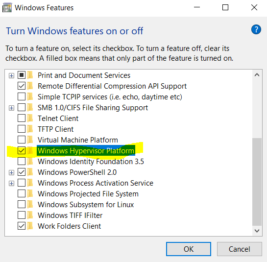
        * Boot the PC
        * Uninstall DCE4W
        * Re-install DCE4w
        * Start DCE4w
        * Error - same as above - yak!
        * Deactivate `windows hypervisor platform`
        * Please uninstall DCE4W again.
        * Boot PC
        * Apparently win Hypervisor does not cover for hyper-v from this old Docker version!  
    * TryFix: Trying to install hyper-v on win 10 home:
        ```bash
        # https://answers.microsoft.com/en-us/windows/forum/all/hyper-v-is-missing/191e7c79-2c95-4417-b877-f40f6f856108
        dism.exe /Online /Enable-Feature:Microsoft-Hyper-V /All

        # Deployment Image Servicing and Management tool
        # Version: 10.0.18362.900

        # Image Version: 10.0.18362.1016

        # Error: 0x800f080c

        # Feature name Microsoft-Hyper-V is unknown.
        # A Windows feature name was not recognized.
        # Use the /Get-Features option to find the name of the feature in the image and try the command again.

        # The DISM log file can be found at C:\windows\Logs\DISM\dism.log
        ```
        * Hyper-V can't be installed on Win 10 Home! It requires Pro or more:
        * So instead we could let it run on VirtualBox
    * Other alternatives: [How to install Windows 10 Home 19018 update?](https://superuser.com/questions/1550291/how-to-install-windows-10-home-19018-update)
    * [Download Windows 10 may 2020 update (v 2004)](https://www.microsoft.com/en-us/software-download/windows10)
        * Click Update Now - this takes a loooong time.
        * Boot the PC
        * Now running os 10.0.19041.423 [v2004](https://docs.microsoft.com/en-us/windows/release-information/)
        * OK, another Hypervisor needs to be activated - Activate the `Virtual Machine Platform` feature.
        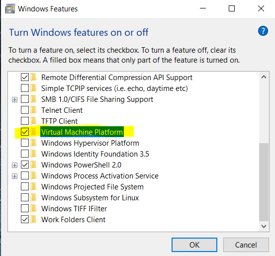
        * Boot the PC
        * [Download DD4W v.2.3.0.4](https://docs.docker.com/docker-for-windows/release-notes/#docker-desktop-community-2304)
            * Choose to enable WSL2  
            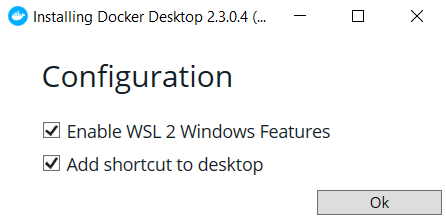
            * Boot the PC
            * WSL2 is now enabled  
            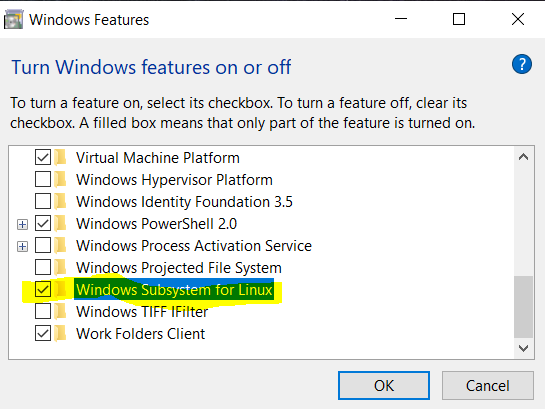  
            * Now you are told to [Update the WSL2 Linux kernel](https://docs.microsoft.com/en-us/windows/wsl/wsl2-kernel)  
            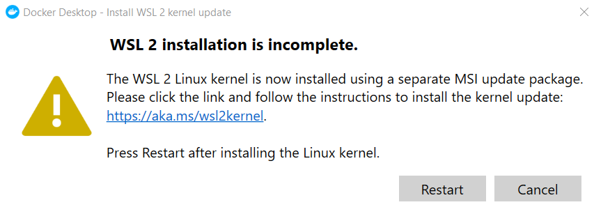  
            * From the link you enter a web, where you can download the X64 update. When you execute it, you see  
            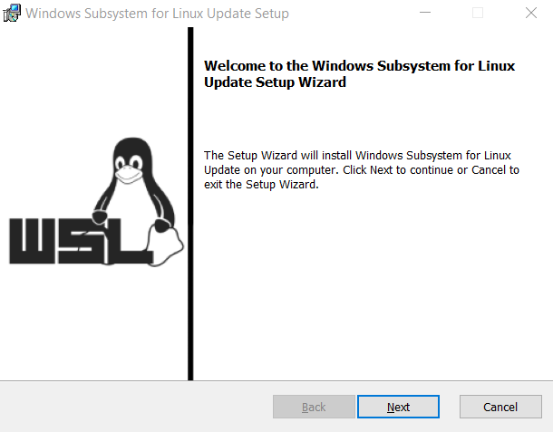  
            * Now press `Restart` - This restarts DD4W - and now it will come up in state `runnning`. You can see it in the taskbar.
              
            * There is a new `virtual network adapter (WSL)`. Before - with Hyper-V there were two: Default switch and DockerNAT  
            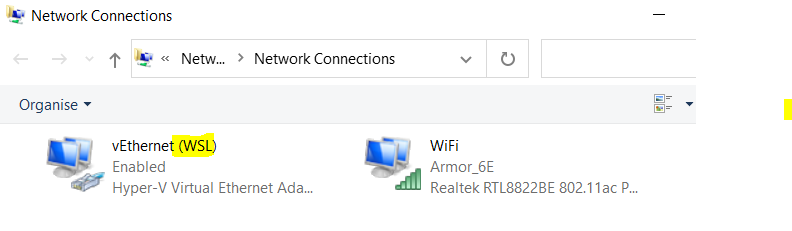  
            ```bash
            # Check that Docker is installed
            docker -v
            # Docker version 19.03.12, build 48a66213fe

            # Check WSL modes (1 or 2):
            wsl -l -v
            #   NAME                   STATE           VERSION
            # * docker-desktop         Running         2
            #   docker-desktop-data    Running         2
            ```
            * Visual Studio Code recommends to install [Remote - WSL extension](https://marketplace.visualstudio.com/items?itemName=ms-vscode-remote.remote-wsl)  
            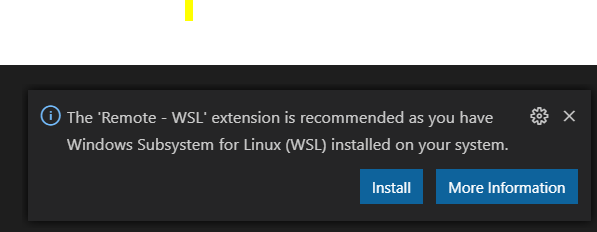  
            * This enables you to start a terminal into the Linux machines running in WSL2  
            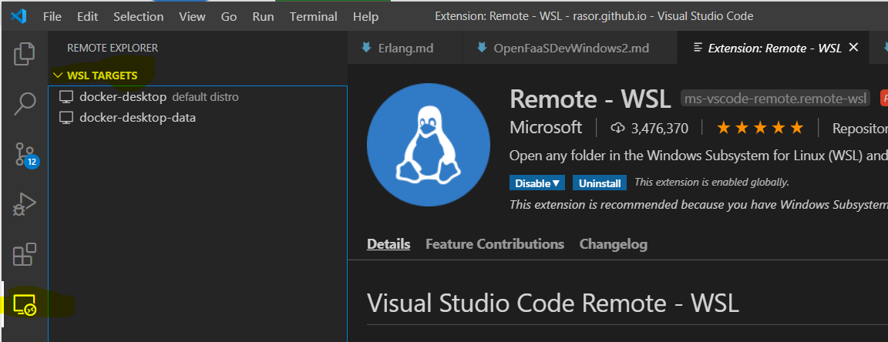  
            * In DD4W settings you see that with Win Home you can only run in WSL2 (opposed to WSL1). We know that - we had to update Win 10 to v2004 in order to install DD4W!  
            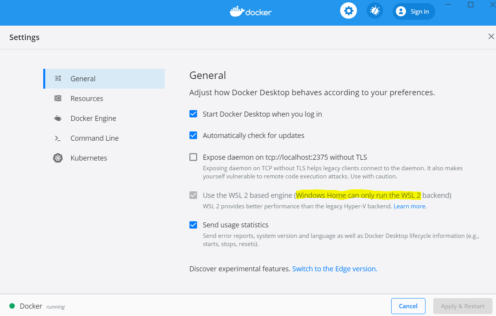  

## Connect to an Image Registry - DockerHub

You need an image registry to read base images from and to save your images to.
I'll just use the public and free **Docker hub**.  
If you don't have an account then create one.  

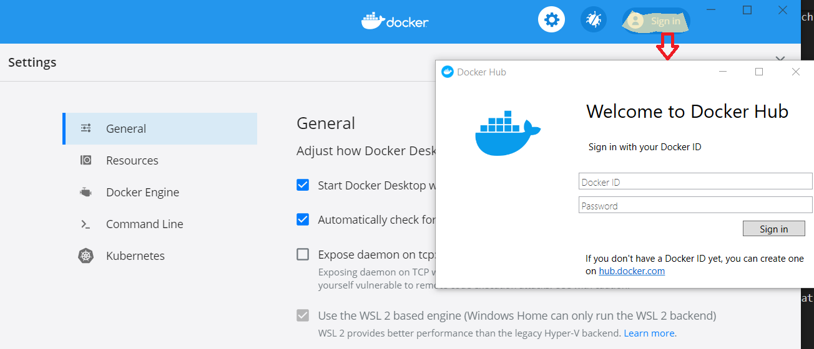  

## Develop with Docker and WSL2 

By using workflow [Develop with Docker and WSL2](https://docs.docker.com/docker-for-windows/wsl/#develop-with-docker-and-wsl-2) then you work with VSCode in your default Linux distro running in a container in WSL2.  
Using VSCode extention [Remote - WSL](https://marketplace.visualstudio.com/items?itemName=ms-vscode-remote.remote-wsl) then you can get a remote CLI into your linux distro by typing `wsl` (and `exit` to get back locally).  
From the remote CLI you startup vscode just as when you work locally: `code .`

But you might be missing a WSL2 distro - I did:
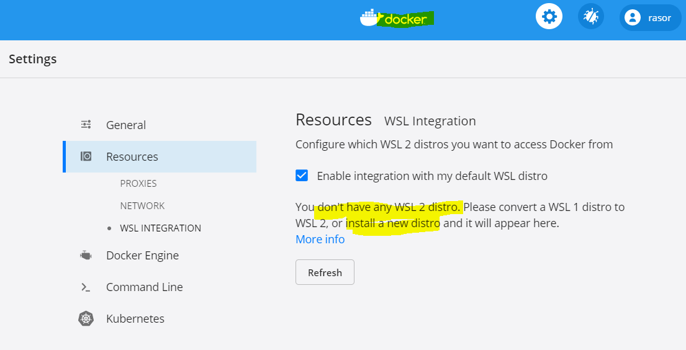.  
There are a small [selection of distros](https://docs.microsoft.com/en-us/windows/wsl/install-win10#install-your-linux-distribution-of-choice).  
Most of all I wanted a CenOS distro, since I want to have OpenShift in it and CentOS is the RedHat community version. There is [Pengwin Enterprise](https://www.microsoft.com/da-dk/p/pengwin-enterprise/9n8lp0x93vcp?rtc=1&activetab=pivot:overviewtab) based on CentOS, but what - now Microsoft wants me to pay for Linúx???  
And also Biz users are required to get a Red Hat Enterprise Linux subscription, when using it.  
I'll go for 2nd best which is [another RPM based distro](https://en.wikipedia.org/wiki/List_of_Linux_distributions#RPM-based).  
I can choose between Fedora and OpenSuse.
Also [Fedora Remix for WSL](https://www.microsoft.com/da-dk/p/fedora-remix-for-wsl/9n6gdm4k2hnc?rtc=1&activetab=pivot:overviewtab) is not free....  
So remaining is [openSUSE-Leap-15-1](https://www.microsoft.com/da-dk/p/opensuse-leap-15-1/9njfzk00fgkv?rtc=1&activetab=pivot:overviewtab), which still is free.  
Also there are two SUSE Enterprise for free.  

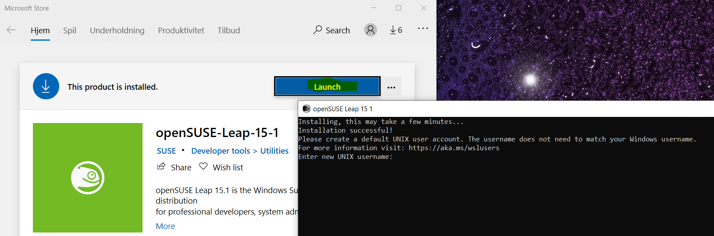  
Note: You have to give this WSL PC a default username and psw - just like your Windows box.  

```bash
wsl -l -v
#   NAME                   STATE           VERSION
# * docker-desktop         Running         2      
#   docker-desktop-data    Running         2      
#   openSUSE-Leap-15-1     Running         1
```

Hmm - Suse is not running wsl2 and is not default

```bash
# future WSLs will be v2
wsl --set-default-version 2

# set suse v2
wsl --set-version openSUSE-Leap-15-1 2
# Conversion in progress, this may take a few minutes...
# For information on key differences with WSL 2 please visit https://aka.ms/wsl2
# Conversion complete.

# so what is status now?
wsl -l -v
#   NAME                   STATE           VERSION
#   openSUSE-Leap-15-1     Stopped         2

# Please help
wsl -h
# Usage: wsl.exe [Argument] [Options...] [CommandLine]
# Options:
#     --distribution, -d <Distro>
#         Run the specified distribution.

# Arguments for managing Windows Subsystem for Linux:
#     --set-default, -s <Distro>
#         Sets the distribution as the default.

# set suse default and start it
wsl --set-default openSUSE-Leap-15-1

# so what is status now?
wsl -l -v
#   NAME                   STATE           VERSION
# * openSUSE-Leap-15-1     Running         2

# Now you can enter your default SUSE wsl just by typing
wsl
```

Notice the local folder in Windows is mounted inside the Linux distro,  
so you are able to work from Linux on your files in your Windows drive.

```bash
rasorwin@MYPC> # Now in Windows
rasorwin@MYPC❯ wsl # Enter SUSE 
rasorsuse@MYPC:/mnt/c/Users/rasorwin> cd .. # Notice current dir is in windows
rasorsuse@MYPC:/mnt/c/Users> ls
All Users  Default  Default User  desktop.ini  Public  rasorwin
rasorsuse@MYPC:/mnt/c/Users> exit # Go back into windows
logout
rasorwin@MYPC>
```

Going back in docker - Press Refresh - then you will also see your OpenSuse installed  
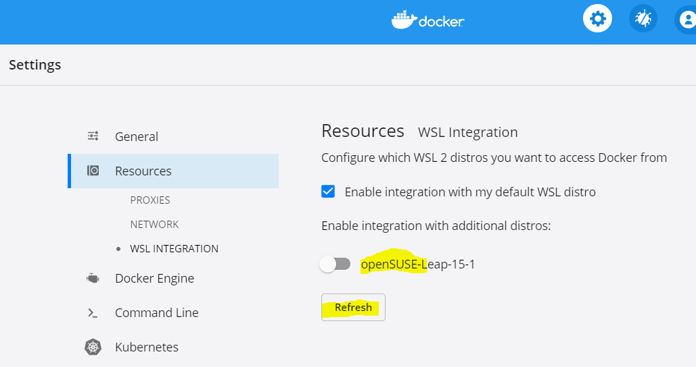  
you don't have to enable integration there, since you have set it default and you have enabled integration to default distro.

### Links

* [Install Docker Desktop on Windows Home](https://docs.docker.com/docker-for-windows/install-windows-home/)
* [DD4W Frequently asked questions (FAQ)](https://docs.docker.com/docker-for-windows/faqs/)

The End.