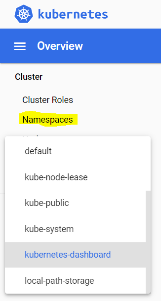

Title:  k8s on Windows Devbox - Part 0.2
Status: draft
Date: 2020-10-12 00:00
Modified: 2020-11-09 10:30
Category: DevOps
Tags: #arkade, #docker, #openfaas, #curl, #hyperv, #virtualbox, #kitematic, #wsl2, #win10, #virtualmachineplatform, #kubernetes-dashboard, #metrics-server, #k8s

This blog is part of a serie:

* [Part 0.1: Install Docker Desktop on Windows 10 Home - including WSL]({filename}/2020/2020-09-07-Docker4Win20.md)
* [Part 0.2: Install k8s using kind on Windows - including arkade]({filename}/2020/2020-10-12-K8sArkade.md) (this blog)
* Others coming ...

I want to install **OpenFaaS** again.  
This time running on **Kubernetes (k8s)**, **Docker Desktop**, **Windows Home 10** with **Virtual Machine Platform** on **WSL2**.  
Running Docker Desktop with [WSL2 backend has many improvements](https://docs.docker.com/docker-for-windows/wsl/) over alternatives.  
Last time I installed Docker (in this [blog](https://rasor.github.io/openfaas-on-windows-devbox.html)), I was running on **Docker Swarm**, **Docker CE**, **Windows Pro 10** and **Hyper-V**.

[@alexellisuk](https://twitter.com/alexellisuk) has build great tools. One being [Arkade](https://github.com/alexellis/arkade).  
It is great for installing lots of K8s goodies both locally and in cloud. It also includes OpenFaaS.

# Install k8s and Arkade on devbox on Windows

## Prerequisites.

You need Docker. Start by typing    
```bash
docker -v
```  
to see if you already have it installed.  
If not then follow [this tutorial to get it]({filename}/2020/2020-09-07-Docker4Win20.md).  
In that blog I ended up with **Docker Desktop** on **Windows Home 10** with **Virtual Machine Platform** incl. **WSL2**.

## About

### About Akade

What is Arkade?  
_Your one-stop CLI for Kubernetes_ (its slogan)

I'll use arkade for installing various k8s CLIs and Apps.  

### About K8S clusters

Now that we have Docker, then it is time to play with Arkade to install k8s and other stuff

But there are other options than **Arkade** to install k8s

* On localhost
    * Using **Kind**
        * [Installing Kubernetes with Kind](https://kubernetes.io/docs/setup/learning-environment/kind/)
        * [kind Quick Start](https://kind.sigs.k8s.io/docs/user/quick-start/)
    * Using **k3d** - for dev, Raspberry Pi or IoT
    * Using **Minikube** - for dev
        * [Install Minikube](https://kubernetes.io/docs/tasks/tools/install-minikube/)
        * [Installing Kubernetes with Minikube](https://kubernetes.io/docs/setup/learning-environment/minikube/)
    * Enable k8s in **Docker Desktop** - for dev
    * OpenShift
* In cloud
    * All cloud providers have their own k8s services:
        * EKS (AWS)
        * AKS (Az)
        * GKE (Google)
        * [Kube100](https://www.civo.com/kube100) (Civo) - a k3s cluster
    * Using **[RKE](https://rancher.com/products)**

So why use Arkade to install k8s?

* If you only need a single node cluster then option 3 - using **Docker Desktop** automates the work you manually can do with **Minikube**.  
* If you need a multi node cluster then option 0 - using **Arkade** automates the work you manually can do with **Kind**.  
* **Arkade** also automates the work you need to do with other k8s related tools.

### Already have a k8s cluster?

k8s install is only the top of the iceberg of Arkade.  
If you already have a k8s cluster then Arkade kicks in by installing lost of 

* k8s apps from e.g. [Helm Hub](https://hub.helm.sh/) (with `ark install`) and/or
* CLIs for k8s or apps (with `ark get`) 

Arkade then __unifies fetching packages__ across platforms.  
Before you would use package tools like:

* `apt-get` on some Linux versions
* `yum` on some other Linux versions
* `choco` on Windows
* `brew` on Mac

and having to deal with all their parameters.  

Under the hood Arkade __simplifies commands__ by using [Helm](https://helm.sh/) as the k8s package manager and `kubectl` commands.

## Install Arkade

```bash
# Check that curl is installed
curl --version
# curl 7.67.0 (x86_64-w64-mingw32) libcurl/7.67.0 OpenSSL/1.1.1d (Schannel) zlib/1.2.11 libidn2/2.3.0 nghttp2/1.39.2
# Release-Date: 2019-11-06
# Protocols: dict file ftp ftps gopher http https imap imaps ldap ldaps pop3 pop3s rtsp smtp smtps telnet tftp
# Features: AsynchDNS HTTP2 HTTPS-proxy IDN IPv6 Kerberos Largefile libz Metalink MultiSSL NTLM SPNEGO SSL SSPI TLS-SRP

# Check that docker is installed
docker -v
# Docker version 19.03.12, build 48a66213fe

# Check that a k8s cluster is not yet installed
kubectl version
# Client Version: version.Info{Major:"1", Minor:"16+", GitVersion:"v1.16.6-beta.0", GitCommit:"e7f962ba86f4ce7033828210ca3556393c377bcc", GitTreeState:"clean", BuildDate:"2020-01-15T08:26:26Z", GoVersion:"go1.13.5", Compiler:"gc", Platform:"windows/amd64"}
# Unable to connect to the server: dial tcp [::1]:8080: connectex: No connection could be made because the target machine actively refused it.

# Check that arkade is not installed
arkade --help
# bash: arkade: command not found

# Install Arkade on Windows
# https://github.com/alexellis/arkade#get-arkade
curl -sLS https://dl.get-arkade.dev | sh
# Downloading package https://github.com/alexellis/arkade/releases/download/0.6.12/arkade.exe as //arkade.exe
# curl: (23) Failed writing body (0 != 16360)

# Trying as-admin
curl -sLS https://dl.get-arkade.dev | sh
# Downloading package https://github.com/alexellis/arkade/releases/download/0.6.12/arkade.exe as //arkade.exe
# chmod: cannot access '//arkade.exe': No such file or directory
# Download complete.

# Running with sufficient permissions to attempt to move arkade to /c/Users/Soren/bin
# mv: cannot stat '//arkade.exe': No such file or directory
# ln: failed to create symbolic link '/c/Users/Soren/bin/ark': No such file or directory
# Creating alias 'ark' for 'arkade'.
# main: line 172: arkade: command not found

```

Both attemps failed - instead get manual recipe from [get.sh](https://raw.githubusercontent.com/alexellis/arkade/master/get.sh)  

1. Open your web browser and go to https://github.com/alexellis/arkade/releases
2. Download the latest release for windows to C:\Users\yourusername\.arkade\bin\arkade`
3. Add path to environment  
`setx PATH "%path%;C:\Users\yourusername\.arkade\bin"`
4. Create a symbolic link
```bash
export ALIAS_NAME="ark"
export REPO=arkade
export BINLOCATION="/c/users/yourusername/.arkade/bin"
chmod +x "$BINLOCATION/$REPO"
ln -sf "$BINLOCATION/$REPO" "$BINLOCATION/$ALIAS_NAME"

# Did it work?
arkade version
#             _             _
#   __ _ _ __| | ____ _  __| | ___
#  / _` | '__| |/ / _` |/ _` |/ _ \
# | (_| | |  |   < (_| | (_| |  __/
#  \__,_|_|  |_|\_\__,_|\__,_|\___|
# Get Kubernetes apps the easy way
# Version: 0.6.12
# Git Commit: 0415b5fa9d0a6740feb3d9093b7555d38c7e1a51

ark get --help
# The get command downloads a CLI or application from the specific tool's releases or downloads page. 
# The tool is usually downloaded in binary format and provides a fast and easy alternative to a package manager.

# Usage:
#   arkade get [flags]

# Examples:
#   arkade get helm
#   arkade get linkerd2 --stash=false

# See which CLIs arkade can install:
ark get
# Use "arkade get TOOL" to download a tool or application:
# faas-cli
# helm
# kubectl
# kubectx
# kind
# k3d
# k3sup
# kubeseal
# inletsctl
# osm
# linkerd2
# kubebuilder
# kustomize
# doctl
# k9s
# civo
# terraform
```

Great - we have Arkade now.  

## Install k8s cluster

Now lets install a k8s cluster.  

```bash
# We need kubectl to manage k8s. Install it:
arkade get kubectl
# Downloading kubectl
# https://storage.googleapis.com/kubernetes-release/release/v1.18.0/bin/windows/amd64/kubectl.exe
# Tool written to: C:\Users\yourusername/.arkade/bin/kubectl.exe

# Did it install?
kubectl version
# Client Version: version.Info{Major:"1", Minor:"19",

# We will use kind to create a k8s cluster, but first install it:
arkade get kind
# Downloading kind
# https://github.com/kubernetes-sigs/kind/releases/download/v0.9.0/kind-windows-amd64
# Tool written to: C:\Users\yourusername/.arkade/bin/kind.exe
kind version
# kind v0.9.0 go1.15.2 windows/amd64

# Crate a k8s cluster:
kind create cluster
# Creating cluster "kind" ...
#  • Ensuring node image (kindest/node:v1.19.1) 🖼  ...
#  ✓ Ensuring node image (kindest/node:v1.19.1) 🖼
#  • Preparing nodes 📦   ...
#  ✓ Preparing nodes 📦
#  • Writing configuration 📜  ...
#  ✓ Writing configuration 📜
#  • Starting control-plane 🕹️  ...
#  ✓ Starting control-plane 🕹️
#  • Installing CNI 🔌  ...
#  ✓ Installing CNI 🔌
#  • Installing StorageClass 💾  ...
#  ✓ Installing StorageClass 💾
# Set kubectl context to "kind-kind"
# You can now use your cluster with:
kubectl cluster-info --context kind-kind
# Kubernetes master is running at https://127.0.0.1:52295
# KubeDNS is running at https://127.0.0.1:52295/api/v1/namespaces/kube-system/services/kube-dns:dns/proxy
# To further debug and diagnose cluster problems, use 'kubectl cluster-info dump'.

# And what is the name of cluster?
kind get clusters
# kind

# If you need to delete your cluster:
# kind delete cluster
# kind delete cluster --name kind

# Seems like I have a client version from docker and a server version is in the cluster with the version installed by arkade.
kubectl version
# Client Version: version.Info{Major:"1", Minor:"16+", GitVersion:"v1.16.6-beta.0", GitCommit:"e7f962ba86f4ce7033828210ca3556393c377bcc", GitTreeState:"clean", BuildDate:"2020-01-15T08:26:26Z", GoVersion:"go1.13.5", Compiler:"gc", Platform:"windows/amd64"}
# Server Version: version.Info{Major:"1", Minor:"19", GitVersion:"v1.19.1", GitCommit:"206bcadf021e76c27513500ca24182692aabd17e", GitTreeState:"clean", BuildDate:"2020-09-14T07:30:52Z", GoVersion:"go1.15", Compiler:"gc", Platform:"linux/amd64"}

# Check cluster location and credentials that kubectl knows about:
kubectl config view
# apiVersion: v1
# clusters:
# - cluster:
#     certificate-authority-data: DATA+OMITTED
#     server: https://127.0.0.1:55555
#   name: kind-kind
# contexts:
# - context:
#     cluster: kind-kind
#     user: kind-kind
#   name: kind-kind
# current-context: kind-kind
# kind: Config
# preferences: {}
# users:
# - name: kind-kind
#   user:
#     client-certificate-data: REDACTED
#     client-key-data: REDACTED

kubectl get nodes
# NAME                 STATUS   ROLES    AGE   VERSION
# kind-control-plane   Ready    master   18m   v1.19.1

kubectl get pods
# No resources found in default namespace.
```

The cluster config seen in `kubectl config view` is stored in C:\Users\youruserid\.kube\config   
When you want to connect to other clusters you need to modify or replace that file.  
In the file one cluster will be your default.  

So now having a master node running and no pod what is next?  

* We could add worker nodes to the cluster
* We could install apps

Issues: 

* Booting Windows made bash unable to access cluster. Why?
    * It was not an envir var problem, since after delete + create cluster then no new envir vars were created
    * In vid [Walk-through of arkade - for Kubernetes](https://www.youtube.com/watch?v=8wU9s_mua8M), Alex think boot persistence has been implemented - and before we had to recreate cluster after boot.
    * Tips about accessing clusters: [Accessing Clusters](https://kubernetes.io/docs/tasks/access-application-cluster/access-cluster/)
    * Perhaps you just need to start the master node: `docker start kind-control-plane`

## Stop and start the cluster

```bash
# stop the k8s cluster
docker stop kind-control-plane

# check if k8s cluster is running
kubectl cluster-info
# Unable to connect to the server: dial tcp 127.0.0.1:52295: connectex: No connection could be made

# Check if there are any clusters
$ kind get clusters
# kind

# Check it the container is running
docker ps -a | grep kind
# CONTAINER ID        IMAGE                  COMMAND                  CREATED             STATUS                   PORTS                       NAMES
# 0b9a7220b4f8        kindest/node:v1.19.1   "/usr/local/bin/entr…"   5 weeks ago         Exited (0) 3 weeks ago   127.0.0.1:52295->6443/tcp   kind-control-plane

# start the k8s cluster
docker start kind-control-plane

# check if k8s cluster is running
kubectl cluster-info
# Kubernetes master is running at https://127.0.0.1:52295
# KubeDNS is running at https://127.0.0.1:52295/api/v1/namespaces/kube-system/services/kube-dns:dns/proxy
```

## Install k8s apps

Arkade makes it easy to install many ready-to-use apps. You can print the list it contains:  

```bash
# Check which apps arkade lets you easily install:
ark install --help
# Install Kubernetes apps from helm charts or YAML files using the "install" command.

# You can also find the post-install message for each app with the "info" command.

# Usage:
#   arkade install [flags]
#   arkade install [command]

# Examples:
#   arkade install
#   arkade install openfaas  --gateways=2
#   arkade install inlets-operator --token-file $HOME/do-token

# Available Commands:
#   argocd                  Install argocd
#   cert-manager            Install cert-manager
#   chart                   Install the specified helm chart
#   cron-connector          Install cron-connector for OpenFaaS
#   crossplane              Install Crossplane
#   docker-registry         Install a Docker registry
#   docker-registry-ingress Install registry ingress with TLS
#   gitea                   Install gitea
#   grafana                 Install grafana
#   info                    Find info about a Kubernetes app
#   ingress-nginx           Install ingress-nginx
#   inlets-operator         Install inlets-operator
#   istio                   Install istio
#   jenkins                 Install jenkins
#   kafka-connector         Install kafka-connector for OpenFaaS
#   kube-image-prefetch     Install kube-image-prefetch
#   kube-state-metrics      Install kube-state-metrics
#   kubernetes-dashboard    Install kubernetes-dashboard
#   linkerd                 Install linkerd
#   loki                    Install Loki for monitoring and tracing
#   metrics-server          Install metrics-server
#   minio                   Install minio
#   mongodb                 Install mongodb
#   nats-connector          Install OpenFaaS connector for NATS
#   nfs-client-provisioner  Install nfs client provisioner
#   openfaas                Install openfaas
#   openfaas-ingress        Install openfaas ingress with TLS
#   openfaas-loki           Install Loki-OpenFaaS and Configure Loki logs provider for OpenFaaS
#   osm                     Install osm
#   portainer               Install portainer to visualise and manage containers
#   postgresql              Install postgresql
#   redis                   Install redis
#   registry-creds          Install registry-creds
#   tekton                  Install Tekton pipelines and dashboard
#   traefik2                Install traefik2

# Flags:
#   -h, --help                help for install
#       --kubeconfig string   Local path for your kubeconfig file (default "kubeconfig")
#       --wait                If we should wait for the resource to be ready before returning (helm3 only, default false)
```
### Install k8s app kubernetes-dashboard

kubernetes-dashboard gives you a GUI for viewing what your cluster contains. Let's install it:

```bash
arkade install kubernetes-dashboard
# Using kubeconfig: C:\Users\youruserid/.kube/config
# Node architecture: "amd64"
# # To create the Service Account and the ClusterRoleBinding
# # @See https://github.com/kubernetes/dashboard/blob/master/docs/user/access-control/creating-sample-user.md#creating-sample-user

cat <<EOF | kubectl apply -f -
---
apiVersion: v1
kind: ServiceAccount
metadata:
    name: admin-user
    namespace: kubernetes-dashboard
---
apiVersion: rbac.authorization.k8s.io/v1
kind: ClusterRoleBinding
metadata:
    name: admin-user
roleRef:
    apiGroup: rbac.authorization.k8s.io
    kind: ClusterRole
    name: cluster-admin
subjects:
- kind: ServiceAccount
    name: admin-user
    namespace: kubernetes-dashboard
---
EOF

# #To get your Token for logging in
kubectl -n kubernetes-dashboard describe secret $(kubectl -n kubernetes-dashboard get secret | grep admin-user-token | awk '{print $1}')
# Shown last part of the output
# Name:         admin-user-token-8ltkm
# Namespace:    kubernetes-dashboard
# Labels:       <none>
# Annotations:  kubernetes.io/service-account.name: admin-user
#               kubernetes.io/service-account.uid: cf8c00d4-e353-46cd-a60f-52b976278a5c

# Type:  kubernetes.io/service-account-token

# Data
# ====
# ca.crt:     1066 bytes
# namespace:  20 bytes
# token:      eyJhbGciOiJSUzI1NiIsImtpZCI6InBXbUdUMG01cHU1b21mWl9HQ2hvckpnc2piTE8xZFhraE16Qnl6b0FUYWsifQ.eyJpc3MiOiJrdWJlcm5ldGVzL3NlcnZpY2VhY2NvdW50Iiwia3ViZXJuZXRlcy5pby9zZXJ2aWNlYWNjb3VudC9uYW1lc3BhY2UiOiJrdWJlcm5ldGVzLWRhc2hib2FyZCIsImt1YmVybmV0ZXMuaW8vc2VydmljZWFjY291bnQvc2VjcmV0Lm5hbWUiOiJhZG1pbi11c2VyLXRva2VuLThsdGttIiwia3ViZXJuZXRlcy5pby9zZXJ2aWNlYWNjb3VudC9zZXJ2aWNlLWFjY291bnQubmFtZSI6ImFkbWluLXVzZXIiLCJrdWJlcm5ldGVzLmlvL3NlcnZpY2VhY2NvdW50L3NlcnZpY2UtYWNjb3VudC51aWQiOiJjZjhjMDBkNC1lMzUzLTQ2Y2QtYTYwZi01MmI5NzYyNzhhNWMiLCJzdWIiOiJzeXN0ZW06c2VydmljZWFjY291bnQ6a3ViZXJuZXRlcy1kYXNoYm9hcmQ6YWRtaW4tdXNlciJ9.HOkirmDW_KEpNcH_W2kotH5V_r_MgxzMiZnYctyP2bdCt7yBZijfwVK6rv3SuYizZM5FuxWsHARR8aFmsIG5wtL4Pv1mS0wHggt1Tt3rX-8Du2kj0UZwjM6pKZ5zECSC-JM1fItUAjsZyad2qxAThPaYtaJw2HVbJHdrQxn7I65kZY9qNGTPevwVrfs8PeUnpeUqlmaeZ9doob0x1zB_3TKvvST9r38m9nsRblfQU2P9QY82Q4qU74sV3lwE5cRs0XuviyQBEvfGxH5od7ahTXea5B5zHA-3_7SSyvLWHvjMMk4fn8_ZWwxJKFYc1zbxL2JqNvqzvvqRqsfbwOjX8g

# #To forward the dashboard to your local machine
kubectl proxy
# Starting to serve on 127.0.0.1:8001

# # Once Proxying you can navigate to the below
# http://localhost:8001/api/v1/namespaces/kubernetes-dashboard/services/https:kubernetes-dashboard:/proxy/#/login
# Paste the token above into the Dashboard login screen
```

You need to copy-paste your token from above to the login screen:  

  

When logged in:  
  

There are several k8s namespaces. Select some to see what they are comprised of:  
  

Issues:

* You get "Default user has too little permissions", if you forget to paste the `cat << EOF` block.
    * Create An [Authentication Token (RBAC)](https://github.com/kubernetes/dashboard#create-an-authentication-token-rbac)
    * Read about [Access control](https://github.com/kubernetes/dashboard/blob/master/docs/user/access-control/README.md)

More info: 

* Other apis exposed though [local proxy](http://127.0.0.1:8001/)
* [Web UI (Dashboard)](https://kubernetes.io/docs/tasks/access-application-cluster/web-ui-dashboard/)
* Github: [kubernetes/dashboard](https://github.com/kubernetes/dashboard)

### Install k8s app metrics-server (- and heml)

Metrics Server is a cluster-wide aggregator of resource usage data.  

Apparently installing metrics-server does also do `arkade get helm`, when it is not yet installed.  
Helm is a package manager for k8s apps (packaged in helm charts).  

```bash
arkade install metrics-server
# Using kubeconfig: C:\Users\youruserid/.kube/config
# Node architecture: "amd64"
# Client: "x86_64", "MINGW64_NT-10.0-19041"
# 2020/09/22 12:41:45 User dir established as: C:\Users\youruserid/.arkade/
# https://get.helm.sh/helm-v3.2.4-windows-amd64.zip
# C:\Users\Soren\AppData\Local\Temp/windows-amd64
# C:\Users\Soren\AppData\Local\Temp/helm.exe
# C:\Users\Soren\AppData\Local\Temp/README.md
# C:\Users\Soren\AppData\Local\Temp/LICENSE
# 2020/09/22 12:42:19 extracted zip into C:\Users\youruserid\AppData\Local\Temp: 4 files, 0 dirs (991.479ms)
# Downloaded to:  C:\Users\youruserid/.arkade/bin/helm.exe helm.exe
# Error: no repositories found. You must add one before updating
# Error: exit code 1

helm version
# version.BuildInfo{Version:"v3.2.4", GitCommit:"0ad800ef43d3b826f31a5ad8dfbb4fe05d143688", GitTreeState:"clean", GoVersion:"go1.13.12"}
```

So what's with `Error: no repositories found`?
[Getting Started with Helm v3](https://www.jforte.me/2020/01/getting-started-with-helm-v3/)

```bash
# Verify repo (list of helm charts) is missing
helm repo update
# Error: no repositories found. You must add one before updating

# get stable repo - this can take 10s of minutes without output in the shell...
helm repo add stable https://kubernetes-charts.storage.googleapis.com/
# "stable" has been added to your repositories
```

On https://helm.sh/docs/intro/quickstart/ in the version dropdown you will see which version of Helm is the latest stable version, which was installed above.  

Having the helm chart list downloaded we try again:
```bash
arkade install metrics-server
# Using kubeconfig: C:\Users\youruserid/.kube/config
# Node architecture: "amd64"
# Client: "x86_64", "MINGW64_NT-10.0-19041"
# 2020/09/24 17:27:20 User dir established as: C:\Users\youruserid/.arkade/
# https://get.helm.sh/helm-v3.2.4-windows-amd64.zip
# C:\Users\youruserid\AppData\Local\Temp/windows-amd64
# C:\Users\youruserid\AppData\Local\Temp/helm.exe
# C:\Users\youruserid\AppData\Local\Temp/README.md
# C:\Users\youruserid\AppData\Local\Temp/LICENSE
# 2020/09/24 17:27:22 extracted zip into C:\Users\youruserid\AppData\Local\Temp: 4 files, 0 dirs (406.024ms)
# Downloaded to:  C:\Users\youruserid/.arkade/bin/helm.exe helm.exe
# Hang tight while we grab the latest from your chart repositories...
# ...Successfully got an update from the "stable" chart repository
# Update Complete. ⎈ Happy Helming!⎈
# Chart path:  C:\Users\youruserid\AppData\Local\Temp/charts
# VALUES values.yaml
# Command: C:\Users\youruserid/.arkade/bin/helm [upgrade --install metrics-server stable/metrics-server --namespace kube-system --values C:\Users\youruserid\AppData\Local\Temp/charts/metrics-server/values.yaml --set args={--kubelet-insecure-tls,--kubelet-preferred-address-types=InternalIP\,ExternalIP\,Hostname}]
# Release "metrics-server" does not exist. Installing it now.
# NAME: metrics-server
# LAST DEPLOYED: Thu Sep 24 17:27:29 2020
# NAMESPACE: kube-system
# STATUS: deployed
# REVISION: 1
# NOTES:
# The metric server has been deployed.

# In a few minutes you should be able to list metrics using the following
# command:

#   kubectl get --raw "/apis/metrics.k8s.io/v1beta1/nodes"
# =======================================================================
# = metrics-server has been installed.                                  =
# =======================================================================

# # It can take a few minutes for the metrics-server to collect data
# # from the cluster. Try these commands and wait a few moments if
# # no data is showing.

# # Check pod usage
# kubectl top pod

# # Check node usage
kubectl top node
# Error from server (ServiceUnavailable): the server is currently unable to handle the request (get nodes.metrics.k8s.io)

# # Find out more at:
# # https://github.com/helm/charts/tree/master/stable/metrics-server

# Thanks for using arkade!

```
So now we have `Error from server (ServiceUnavailable)`.  
Try fix: [issue 448](https://github.com/kubernetes-sigs/metrics-server/issues/448).  

```bash
# Is pod running?
kubectl get pods -n kube-system
# NAME                                         READY   STATUS    RESTARTS   AGE
# metrics-server-56c4ff648b-jdzv6              1/1     Running   0          53m

# Is service running?
kubectl get svc -n kube-system
# NAME             TYPE        CLUSTER-IP      EXTERNAL-IP   PORT(S)                  AGE
# metrics-server   ClusterIP   10.106.132.12   <none>        443/TCP                  55m
```

3 days later ...

```bash
kubectl top node
# NAME                 CPU(cores)   CPU%   MEMORY(bytes)   MEMORY%
# kind-control-plane   473m         5%     952Mi           8%

kubectl top pod

kubectl get --raw "/apis/metrics.k8s.io/v1beta1/nodes"
# Error from server (NotFound): the server could not find the requested resource
```

Start proxy in another terminal
```bash
kubectl proxy
```
Then open browser http://127.0.0.1:8001/
```json
{
    "paths": [
        "/apis/metrics.k8s.io",
        "/apis/metrics.k8s.io/v1beta1",
```

http://127.0.0.1:8001/apis/metrics.k8s.io/v1beta1/nodes 
gives "ERR_CONNECTION_REFUSED"

OK, I'm not done with this, but I'll fill in, when focus comes back onto it...

More info:

* Metrics Server:
    * [helm/charts - metrics-server](https://github.com/helm/charts/tree/master/stable/metrics-server)
    * Github: [kubernetes-sigs/metrics-server](https://github.com/kubernetes-sigs/metrics-server)
    * k8s Debug: [Resource metrics pipeline](https://kubernetes.io/docs/tasks/debug-application-cluster/resource-metrics-pipeline/)
* Helm:
    * [Quickstart Guide](https://helm.sh/docs/intro/quickstart/)
    * Download: [Releases · helm/helm](https://github.com/helm/helm/releases)
    * [helm/charts](https://github.com/helm/charts/tree/master/stable)


# What's next?

I didn't get the the OpenFaaS part, yet - I'll park that for later.  

I also want to build apps on a solid setup.  
What I have in mind is the [Bitnami stack](https://kubeprod.io/)  
  
(_Image on kubeprod.io_)

* Apps - e.g [Kubeapps, deploy your applications in Kubernetes](https://kubeapps.com/)
    * [Charts hub](https://hub.kubeapps.com/charts)
    * [Get Started with Kubeapps](https://github.com/kubeapps/kubeapps/blob/master/docs/user/getting-started.md)
* BKPR (Bitnami Kubernetes Production Runtime)
    * Monitoring
        * Prometheus
        * Grafana
        * Alertmanager
    * Logging
        * Fluentd
        * Elasticsearch
        * Kibana
    * Ingress
        * nginx-ingress
        * ExternalDNS
        * cert-manager
        * OAuth2 Proxy
* k8s
    * Google Kubernetes Engine (GKE), 
    * Azure Kubernetes Service (AKS) and 
    * Amazon Elastic Container Service for Kubernetes (EKS)

I might want to add to the stack:

* [charts/rabbitmq](https://hub.kubeapps.com/charts?q=rabbitmq)

Some apps I have in mind could be 

* A DeFi app using 
    * a private [ethereum](https://hub.kubeapps.com/charts/stable/ethereum) network as transaction and currency cluster
    * [vulcanlink](https://hub.kubeapps.com/charts/vulcanlink) - chainlink as Dapp GW
        * [Vulcan Link](https://vulcan.link/)
    * Dedicated [Elastos DID sidechain](https://elastos.academy/did/) as customer IdM cluster
        * [Bringing Chainlink to Elastos Mainnet](https://medium.com/@leo.vigna/bringing-chainlink-to-elastos-mainnet-9134bb3da6c9)    
    * [Gnosis Safe](https://gnosis-safe.io/) as multisig provider
    * Perhaps use aelf as common sidechain?  
      
    (_Image on [twitter](https://twitter.com/aelfblockchain/status/1308688001073991680/photo/1)_)

# More Links

* Docker:
    * [Logs and troubleshooting](https://docs.docker.com/docker-for-windows/troubleshoot/)
* k8s:
    * [Kubectl Reference Docs](https://kubernetes.io/docs/reference/generated/kubectl/kubectl-commands)
    * [kubectl Cheat Sheet](https://kubernetes.io/docs/reference/kubectl/cheatsheet/)
    * [Deploy on Kubernetes](https://docs.docker.com/docker-for-windows/kubernetes/)
    * [Deploy on Kubernetes - Example app](https://docs.docker.com/docker-for-windows/kubernetes/#example-app)
    * Vid 2017: [Create a 2-node Kubernetes cluster in 10 minutes](https://www.youtube.com/watch?v=6xJwQgDnMFE)
    * When k8s? [Alex Ellis posted on LinkedIn](https://www.linkedin.com/posts/alexellisuk_then-he-asked-me-is-kubernetes-right-for-activity-6703625976351346688-6343)
    * Vid: [Kubernetes and Container Orchestration 101 - Hanselman](https://www.youtube.com/watch?v=3RTvoI-A7UQ)
    * [Init Containers](https://kubernetes.io/docs/concepts/workloads/pods/init-containers/)
    * [Best Practices for Monitoring and Alerting on Kubernetes](https://rancher.com/learning-paths/best-practices-for-monitoring-and-alerting-on-kubernetes/)
        * [bashofmann/rancher-2.5-monitoring](https://github.com/bashofmann/rancher-2.5-monitoring)
        * [Events](https://rancher.com/events)
* k3s (k8s that can run on Raspberry Pi):
    * SaaS: [Managed Kubernetes service, powered by k3s - Civo.com](https://www.civo.com/)
* Kind:
    * [Installation](https://kind.sigs.k8s.io/#installation-and-usage)
    * [Quick start](https://kind.sigs.k8s.io/docs/user/quick-start/)
* helm: 
    * [Artifact Hub](https://artifacthub.io/)
* Arkade:
    * [alexellis/arkade](https://github.com/alexellis/arkade)
    * [Alex Ellis - arkade](https://www.linkedin.com/posts/alexellisuk_kubernetes-cloudnative-cncf-activity-6702550586610487296-atGD)
    * Vid 2020: [Walk-through of arkade - for Kubernetes](https://www.youtube.com/watch?v=8wU9s_mua8M)
* OpenFaaS:
    * My blog 2019:[OpenFaaS on Windows Devbox](https://rasor.github.io/openfaas-on-windows-devbox.html)
    * [Kubernetes - OpenFaaS](https://docs.openfaas.com/deployment/kubernetes/)
* VPN Connect to OnPrem server/service
    * [inlets: Cloud Native Tunnel](https://docs.inlets.dev/#/)
    * Ngrok

The End
