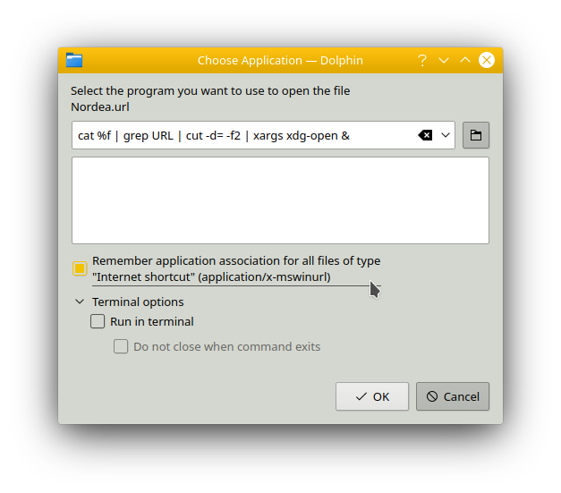

Title: Install LinuxKubuntu on Laptop
Date: 2099-01-01 00:00
Category: DevOps
Tags: #linux, #popos, #ubuntu, #ssh, #github, #snapstore, #nodejs, #kde

HowTo get from Window to Ubuntu fork - Kubuntu.  

Kubuntu is an Ubuntu with a **KDE** desktop.  
Ubuntu ships with **Gnome** desktop, which currently has problems with desktop shortcuts, so I wanted to try KDE.  

# Install

First you [install Kubuntu](https://kubuntu.org/alternative-downloads) from a bootable USB stick.  
I used v. 19.10 (eoan).  
```bash
cd ~/Downloads
# Verify checksum
sha256sum kubuntu-19.10-desktop-amd64.iso
# e56388512a0610bd991192b197a13f1496c107377d9c96d332939c08e305b028
```

## Kubuntu OOTB - out of the box

* **KDE** Desktop
    * **Dolphin** Filemanager
    * **KSysGuarfd** System Monitor
    * **KDE Partition manager**
* **Discover** appstore
    * Including **snapd**
    * Including **Software Sources** - `sudo software-properties-qt`
* **Kate** code editor

## After Install

Blogs and lists like the one I am writing 

* List: [reorx](https://gist.github.com/reorx/4066620#install)

### System Settings

* Input Devices - Touchpad - **Right-Click**: Change from bottom-right to **two-fingers** - this is normal behavior on a Mac. 
It also removes the annoying effect the middle button has in a browser - closing a tab. **Middle-button-click** is now changed to **three fingers**.

### Dolphin

#### Opening Windows .url files

Double-click on a Windows `.url` file. Since Linux don't know what to do with it then it will ask for a program to handle it.  
Enter `cat %f | grep URL | cut -d= -f2 | xargs xdg-open &`. This will open the url from the file in the default browser.
  

It saves the cfg into `$HOME/.local/share/applications/cat.desktop` with the content
```text
[Desktop Entry]
Exec=cat %f | grep URL | cut -d= -f2 | xargs xdg-open &
MimeType=application/x-mswinurl;
Name=cat
NoDisplay=true
Type=Application
```

Thanks to [Saidul Hassan](https://saidulhassan.com/open-url-files-in-linux-mint-ubuntu-1029)

## Starting with [nvm](https://github.com/nvm-sh/nvm) and [node](https://nodejs.org/en/)

From Windows I have gotten used to start with installing nvm, so nvm was not disturbed by having node installed before nvm. So why not continue with the habbit?

```bash
# Install nvm https://github.com/nvm-sh/nvm
wget -qO- https://raw.githubusercontent.com/nvm-sh/nvm/v0.35.1/install.sh | bash
# restart terminal
nvm -v
# Install node LTS https://nodejs.org/en/
nvm install 12.13.0
nvm list
```

## Install From Discover

**Discover** is the appstore for KDE.  
It uses **snapd** - the Snap Daemon. But not all apps in the Snap Store is found through Discover, so you can install that, too. Snapd is found under **Installed** as **core**.  

* [Snap Store](https://snapcraft.io/snap-store) - extra app store
* [Snapcraft](https://snapcraft.io/snapcraft) - package your own apps (in containers)
* [ClamAV](https://www.clamav.net/downloads) - Anti Virus CLI
* ClamTK - Gui for above
* git
* [keychain](https://www.funtoo.org/Keychain) - for SSH and PGP keys - see more in section [git](#git)
* curl
* Visual Studio Code
    * Optional (when coding C#): [.NET Core SDK](https://dotnet.microsoft.com/download/linux-package-manager/ubuntu19-04/sdk-current) for VSCode
    * Install [plugins](https://github.com/rasor/awesome-tables/blob/master/awesome-plugins.md#visual-studio-code)

## Install from Snap Store

* PowerShell - installed into `/snap/powershell/77/opt/powershell/pwsh`

## Install from apt, wget, curl

### LaunchPad

[Launchpad](https://launchpad.net/) is an apt **package hosting site**. It shall not be installed, but several packages below are downloaded from there.  
The package needs to match the Ubuntu version. If it does not, then you need to specify the version the repo does contain e.g.
`deb http://ppa.launchpad.net/yubico/stable/ubuntu disco main`  
Read more below at Yubico.  

### [appimaged](https://askubuntu.com/questions/902672/registering-appimage-files-as-a-desktop-app/935249#935249)

AppImageD allows you to Pin AppImage programs to Task Manager.  

```bash
# Install
cd ~
wget "https://github.com/AppImage/appimaged/releases/download/continuous/appimaged-x86_64.AppImage"
chmod +x appimaged-x86_64.AppImage
./appimaged-x86_64.AppImage --install

# After logout/login you will find appimaged in:
cd ~/.local/bin
```

appimaged will run on startup as a daemon.  

Workflow:
* Download AppImage files
* Move it to ~/.local/bin
* Run it
* Right-click - Pin to Task Manager

Now you can execute you AppImage as a normal APT install.  

More info on [appimages](https://itsfoss.com/use-appimage-linux/)

### xClip

A copy-paste tool  

Install [xClip](https://www.cyberciti.biz/faq/xclip-linux-insert-files-command-output-intoclipboard/)
```bash
sudo apt-get install xclip
```

xClip is used by 

* [Paste URL](https://marketplace.visualstudio.com/items?itemName=kukushi.pasteurl) VSCode plugin  
* The follwing Git install

### UNetbootin

For creating bootable USBs.  

[Install UNetbootin](https://unetbootin.github.io/linux_download.html):
```bash
sudo add-apt-repository ppa:gezakovacs/ppa
sudo apt-get update
sudo apt-get install unetbootin
```

Notes: 

* Before use: Erase content from USB via `KDE Partition Manager` and re-create a new FAT32 partition on the USB.  
* Alternatives:
    * [Tuxboot](https://tuxboot.org/)
    * [Rufus](https://rufus.ie/) - for Windows
* About Using [Clonezilla](https://clonezilla.org/clonezilla-live.php) and GParted: [BSOD with new PC and old SSD](https://rasor.wordpress.com/2013/08/01/bsod-with-new-pc-and-old-ssd/)

### pCloud

pCloud is an idrive.  
It [integrates into filemanagers](https://www.pcloud.com/how-to-install-pcloud-drive-linux.html?download=electron-64).  
It [integrates into terminals](https://github.com/pcloudcom/console-client).

### Yubikey

For Timebased-OneTime-Passcodes (TOTP) using Yubikey:  

* [Yubico Authenticator](https://www.yubico.com/products/services-software/download/yubico-authenticator/) - called yubioath-desktop in CLI.  

```bash
# 64-bit Debian
sudo apt-add-repository ppa:yubico/stable
# Above will add apt repo to Other Software
sudo software-properties-qt # this will open Software Sources
```

Avoiding error [E: Unable to locate package yubioath-desktop](https://github.com/Yubico/yubioath-desktop/issues/479#issuecomment-555176515):

* Goto tab Other Software - you should have a line with http://ppa.launchpad.net/yubico/stable/ubuntu eoan main.  
But yubico on [eoan (19.10) main does not include Yubico Authenticator](https://launchpad.net/%7Eyubico/+archive/ubuntu/stable/+index?field.series_filter=eoan)  
So we [need an older one from disco (19.04)](https://launchpad.net/~yubico/+archive/ubuntu/stable/+index?field.series_filter=disco)
* In Other Software - de-select the eoan version  
* Add `deb http://ppa.launchpad.net/yubico/stable/ubuntu disco main` and select it

```bash
# verify source list is updated
kate /etc/apt/sources.list
# update sw from Other Software (and all the other sources)
sudo apt update
# you should now be able to find the authenticator in your repos
apt list yubi*
# if you got it in the list you can install it
sudo apt install yubioath-desktop
apt list yubi*
# yubioath-desktop/disco,now 4.3.6~ppa1~disco1 amd64 [installed]
```

Notes
* Some browsers supporting Yubikey: Chrome, Brave, Opera

### Brave

[Intall](https://brave-browser.readthedocs.io/en/latest/installing-brave.html#ubuntu-16-04-and-mint-18) via CLI
```bash
sudo apt install apt-transport-https #curl

curl -s https://brave-browser-apt-release.s3.brave.com/brave-core.asc | sudo apt-key --keyring /etc/apt/trusted.gpg.d/brave-browser-release.gpg add -

source /etc/os-release

echo "deb [arch=amd64] https://brave-browser-apt-release.s3.brave.com/ $UBUNTU_CODENAME main" | sudo tee /etc/apt/sources.list.d/brave-browser-release-${UBUNTU_CODENAME}.list
# deb [arch=amd64] https://brave-browser-apt-release.s3.brave.com/ eoan main
sudo apt update
sudo apt install brave-browser
```

Setting Brave as default browser:  
* System Settings - Personalization - Applications - Web Browser: Brave

* brave://settings/
    * Turn off everything under Autofill

[Extensions](https://chrome.google.com/webstore/category/extensions?hl=en-US)

* Password manager
* [Avast Online Security](https://chrome.google.com/webstore/detail/avast-online-security/gomekmidlodglbbmalcneegieacbdmki?hl=en)

### Chrome (for less trusted extensions)

* Download: [Google Chrome](https://www.google.com/intl/en/chrome/)

[Extensions](http://chrome://extensions/)

* [Avast Online Security](https://chrome.google.com/webstore/detail/avast-online-security/gomekmidlodglbbmalcneegieacbdmki?hl=en)
* [Video Downloader professional](https://chrome.google.com/webstore/detail/video-downloader-professi/elicpjhcidhpjomhibiffojpinpmmpil?hl=en)

### Keybase

Keybase is a cloud vault (a kind like password managers) using keys from devices for encryption (unlike the psw mgrs, that uses a master key).  
This enables encrypted sharing between users and trust based on proofs written to social networks.  

* [Install Linux | Keybase Docs](https://keybase.io/docs/the_app/install_linux)

```bash
# 64-bit Debian install
curl --remote-name https://prerelease.keybase.io/keybase_amd64.deb
sudo apt install ./keybase_amd64.deb
run_keybase

# Using:
# are you a programmer? some terminal examples
keybase prove twitter
keybase id chris
keybase help

# KBFS examples
cat /keybase/public/chris/plan.txt
echo "dirty secret" > /keybase/private/yourname/diary.txt
echo "Dear world, check me out." > /keybase/public/yourname/plan.txt
```

Your private files will now be available in `/run/user/1000/keybase/kbfs/private/<userid>`

### Git

* Prerequisites
    * From Discover installed git and VSCode
* Guides
    * [Connecting to GitHub with SSH](https://help.github.com/en/articles/connecting-to-github-with-ssh)
    * [Changing a remote URL](https://help.github.com/en/articles/changing-a-remotes-url#switching-remote-urls-from-https-to-ssh)

Optionally add some author info:

```bash
git --version
# git version 2.20.1

git config --global user.name "Your Name"
git config --global user.email "youremail@domain.com"
git config --list
# user.name=Your Name
# user.email=youremail@domain.com

# The information you entered is stored in your Git configuration file ~/.gitconfig
```

If you use 2FA on github, then SSH access with a private key avoids having a `Personal Access Token` to risk to loose and having to cache. More info on [Which remote URL should I use?](https://help.github.com/en/articles/which-remote-url-should-i-use#cloning-with-ssh-urls).  
So from VSCode rather like to use SSH access (opposed to HTTPS access).  
Since you can just regenerate a new SSH key pair, then you don't have to save your private key for later use.  

Warning: You should not give the SSH key a passphrase to avoid trouble in VSCode
* Ref: 
[Version Control in Visual Studio Code](https://code.visualstudio.com/docs/editor/versioncontrol#_can-i-use-ssh-git-authentication-with-vs-code)
* But you might get it working by [Storing SSH key passphrase in KDE Wallet](https://wiki.archlinux.org/index.php/KDE_Wallet#Using_the_KDE_Wallet_to_store_ssh_key_passphrases)

```bash
# Check for existing SSH keys
ls -al ~/.ssh
# Are there any you want to reuse?

# I want to generate a new key pair
cd ~/.ssh
ssh-keygen -t rsa -b 4096 -C "youremail@domain.com"
# Generating public/private rsa key pair.
# Enter file in which to save the key (/home/youruserid/.ssh/id_rsa): id_rsa_youruserid_github
# Enter passphrase (empty for no passphrase): 
# Enter same passphrase again: 
# Your identification has been saved in id_rsa_youruserid_github.
# Your public key has been saved in id_rsa_youruserid_github.pub.
# The key fingerprint is:
# SHA256:X4uMb123456789012345678901234567rWzWRZD1Szl youremail@domain.com
# The key's randomart image is:
# +---[RSA 4096]----+

# Avoid error "Can't clone git repo and getting error ssh_askpass: exec(/usr/bin/ssh-askpass): No such file or directory Host key verification failed"
# https://stackoverflow.com/questions/52711525/cant-clone-git-repo-and-getting-error-ssh-askpass-exec-usr-bin-ssh-askpass
ssh-keyscan -t rsa github.com >> ~/.ssh/known_hosts
# github.com:22 SSH-2.0-OpenSSH_7.2p2 Ubuntu-4ubuntu2.8
ssh-keyscan -t rsa gitlab.com >> ~/.ssh/known_hosts
ssh-keyscan -t rsa bitbucket.org >> ~/.ssh/known_hosts
ssh-keyscan -t rsa ssh.dev.azure.com >> ~/.ssh/known_hosts
```

Now you are ready to use your key.  
When using it to connect to Github from VSCode you should start VSCode from a prompt like this:

in ~/.bash_profile add your newly generated ssh key
```bash
# Add your SSH key to SSH Agent
eval `keychain --eval --agents ssh id_rsa_youruserid_github`
# Now you don't have to add your SSH key to agent (`ssh-add`) before you commit to github.
```

Note: keychain was installed via Discover.  
Extra info on [keychain...](https://www.funtoo.org/Keychain)

Open a new bash shell to make it take effect.

Add a new SSH key to your GitHub (bitbucket, gitlab, etc) account

```bash
# verify that keychain in installed
eval `keychain`
# * keychain 2.8.5 ~ http://www.funtoo.org
# * Found existing ssh-agent: 1522

# Copy the contents of the id_rsa_youruserid_github.pub file to your clipboard
xclip -sel clip < ~/.ssh/id_rsa_youruserid_github.pub
```

* Goto [https://github.com/settings/keys](https://github.com/settings/keys)
    * or [bitbucket](https://bitbucket.org/account/user/your_userid/)
    * or [dev.azure](https://dev.azure.com/your_userid/_usersSettings/keys)
    * or [gitlab.com](https://gitlab.com/profile/keys)
* New SSH key
* Paste key: Ctrl-V
* Title: vscode_youruserid_github
* Save key: Add SSH key

Finally you need to change urls on your local repos remote origin from HTTPS to SSH

```bash
cd your_local_repo
# Print remote url
git remote -v
# is it using HTTPS?

# Change to SSH (get the SSH url from your remote repo on github)
git remote set-url origin git@github.com:USERNAME/REPOSITORY.git
# or if origin was removed:
git remote add origin git@github.com:USERNAME/REPOSITORY.git
# Print remote url
git remote -v
```

### .NET Core SDK

[Install .NET Core 3.0 SDK (v3.0.101) on Linux](https://dotnet.microsoft.com/download/linux-package-manager/sdk-current)
```bash
wget -q https://packages.microsoft.com/config/ubuntu/19.04/packages-microsoft-prod.deb -O packages-microsoft-prod.deb
sudo dpkg -i packages-microsoft-prod.deb
sudo apt-get update
sudo apt-get install apt-transport-https
sudo apt-get update
sudo apt-get install dotnet-sdk-3.0
# verify install
dotnet --info
# .NET Core SDK (reflecting any global.json):
# Version:   3.0.100
```

### Azure CLI and PS1

[Install the Azure CLI on Linux with apt](https://docs.microsoft.com/en-us/cli/azure/install-azure-cli-apt?view=azure-cli-latest)
```bash
# BASH
# Install Azure CLI
curl -sL https://aka.ms/InstallAzureCLIDeb | sudo bash
# If you get into problems it be that you in SW sources should change from eoan (19.10) to disco (19.04) and do one more apt update and install
# verify install
az -v
# azure-cli                         2.0.
az login
```

```ps1
# PS1
$host
# Name             : ConsoleHost
# Version          : 6.2.3
# Install Azure module
Install-Module -Name Az -AllowClobber -Scope CurrentUser
# Print installed modules
get-module
# List all az commands in currently installed az. modules
Get-Help 'get-az'
# PS1 login
connect-azaccount
```

More on [Azure](https://github.com/rasor/rasor.github.io/blob/pelican/content/2019/AzPractize.md)

# Links

* [LinuxPoposInstall](../2019/LinuxPoposInstall.md)

The End