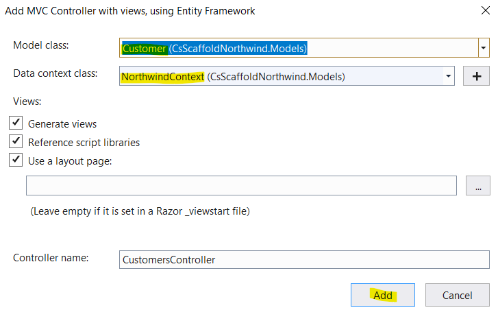

Title: Scaffolding DB layer from DB
Status: published
Date: 2021-02-14 00:00
Modified: 2021-02-14 00:00
Category: Develop
Tags: #csharp, #ef, #db, #mvc, #scaffold, #northwind

## Intro

ASP.NET MVC has build-in scaffolding enabling you to generate a frontend from a DB with a snap, so you can browse your DB. This has been a feature since around 2010.  

It is a great feature to use for PoCs and demos.  

In this blog I'll use Northwind DB and scaffold a view of `customers` - and later on other views.

## Install

### Prerequisites

* SMSS
* Visual Studio

### Install Northwind SQL DB

* Clone [Northwind DB](https://github.com/Microsoft/sql-server-samples/tree/master/samples/databases/northwind-pubs)
* or clone a [subset](https://github.com/microsoft/sql-server-samples#cloning-only-a-subset-of-the-repo-with-sparse-checkout)

```bash
# Bash:
# full clone
git clone https://github.com/microsoft/sql-server-samples.git
cd sql-server-samples/samples/databases/northwind-pubs
```

* Open SMSS
* Connect to the target SQL Server
    * In my case I connect to `localhost\SQLEXPRESS`
* Open `instnwnd.sql` in SMSS
* Execute `instnwnd.sql`

```sql
-- check if we got some data
SELECT * FROM orders
-- gives 830 rows
```

## Scaffold

### Create a webapp

```bash
# Bash:
mkdir CsScaffoldNorthwind
cd CsScaffoldNorthwind

# We need a c# web template - what is its name?
dotnet new -l
# dotnet gitignore file                             gitignore                                  Config
# ASP.NET Core Web App (Model-View-Controller)      mvc                      [C#], F#          Web/MVC
# Solution File                                     sln                                        Solution
dotnet new mvc
# We need a solution file
dotnet new sln
# We need a gitignore file
dotnet new gitignore

# Test build and run
dotnet build
dotnet run
```

Open the web in a browser on either  

* https://localhost:5001/ or
* http://localhost:5000/
* Press Ctrl-C to stop the webserver

#### Testing the webapp from VS  

* Open the sln file in VS
* In Sln Explorer right-click sln and add existing project - select CsScaffoldNorthwind.csproj
* In the Run-dropdown select `CsScaffoldNorthwind`
* Press F5. Now VS will run `dotnet run` in the background and start a browser for you.

Above code is [V.0.0.1](https://github.com/rasor/CsScaffoldNorthwind/releases/tag/0.0.1)

### Add EF to dotnet

```bash
# In project folder add Nuget Package for your code
dotnet add package Microsoft.EntityFrameworkCore.SqlServer
# info : PackageReference for package 'Microsoft.EntityFrameworkCore.SqlServer' version '5.0.3' added to file \CsScaffoldNorthwind.csproj'.

# Install the EF Tool
dotnet ef -help
# Could not execute because the specified command or file was not found.
dotnet tool install --global dotnet-ef
# You can invoke the tool using the following command: dotnet-ef
# Tool 'dotnet-ef' (version '5.0.3') was successfully installed.
dotnet ef --version
# Entity Framework Core .NET Command-line Tools
# 5.0.3

# When you need to update do:
dotnet tool update

# Add yet a Nuget package
dotnet add package Microsoft.EntityFrameworkCore.Design
# info : PackageReference for package 'Microsoft.EntityFrameworkCore.Design' version '5.0.3' added to file \CsScaffoldNorthwind.csproj'.
```

### Scaffold using EF

```
dotnet ef dbcontext scaffold "Server=localhost\SQLEXPRESS;Database=Northwind;Trusted_Connection=True;" Microsoft.EntityFrameworkCore.SqlServer --output-dir Models
```

This added approx 25 models from the DB.  

Above code is [V.0.0.2](https://github.com/rasor/CsScaffoldNorthwind/releases/tag/0.0.2)

* In VS Right click on Controller folder - Add - New scaffolding Item
    * Select `MVC Controller with views, using EF`
    * Select model (customers) and DB  
      
* Run (F5)
* Browse to https://localhost:5001/customers
    * Gives you `InvalidOperationException: Unable to resolve service for type 'CsScaffoldNorthwind.Models.NorthwindContext'`
* Add to `appsettings.Development.json`:

```jsonc
// appsettings.Development.json
  "ConnectionStrings": {
    "DefaultConnection": "Server=localhost\\SQLEXPRESS;Database=Northwind;Trusted_Connection=True;"
  },
```
* Add to `startup.cs`:

```csharp
// startup.cs
        public void ConfigureServices(IServiceCollection services)
        {
            services.AddControllersWithViews();

            // Add this:
            var connectionString = Configuration.GetConnectionString("DefaultConnection");
            services.AddDbContext<NorthwindContext>(options => options.UseSqlServer(connectionString));
        }
```
* Run (F5)
* Browse to https://localhost:5001/customers

Above code is [V.0.0.3](https://github.com/rasor/CsScaffoldNorthwind/releases/tag/0.0.3)

## Links

* [Scaffolding ASP.NET Core MVC](https://www.c-sharpcorner.com/article/scaffolding-asp-net-core-mvc/)
* [ASP.NET MVC - Scaffolding - Tutorialspoint](https://www.tutorialspoint.com/asp.net_mvc/asp.net_mvc_scaffolding.htm)
* [Installing Entity Framework Core - EF Core](https://docs.microsoft.com/en-us/ef/core/get-started/overview/install)
* [Connection Strings - EF Core](https://docs.microsoft.com/en-us/ef/core/miscellaneous/connection-strings)
* [Get the sample SQL Server databases for ADO.NET code samples - ADO.NET](https://docs.microsoft.com/en-us/dotnet/framework/data/adonet/sql/linq/downloading-sample-databases#get-the-northwind-sample-database-for-sql-server)

The End.
