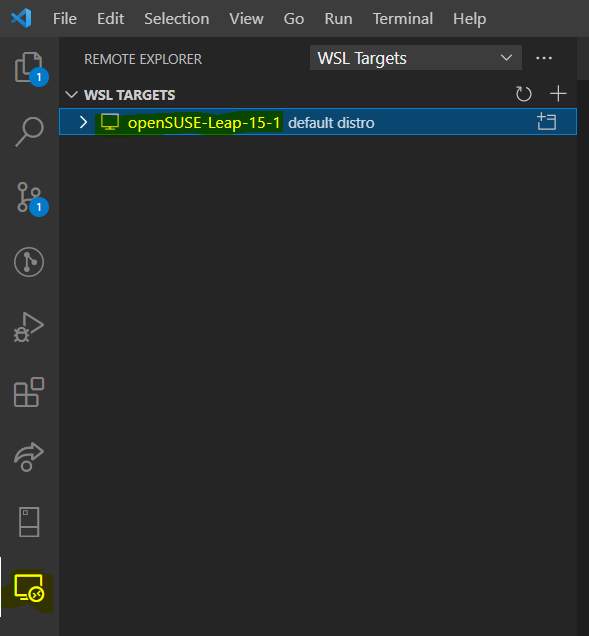
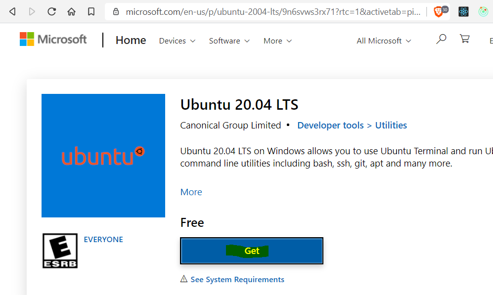
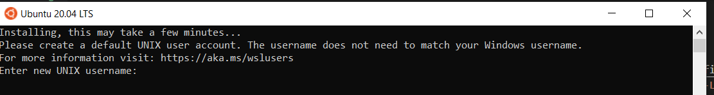
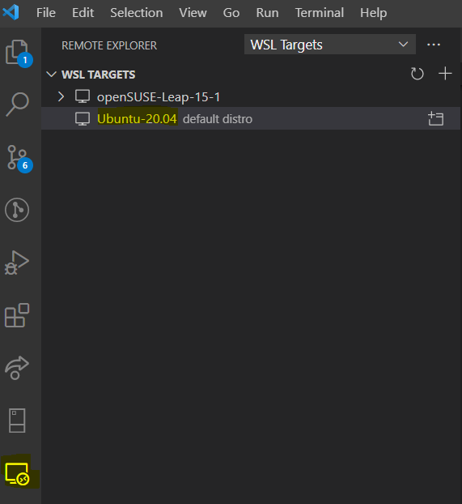
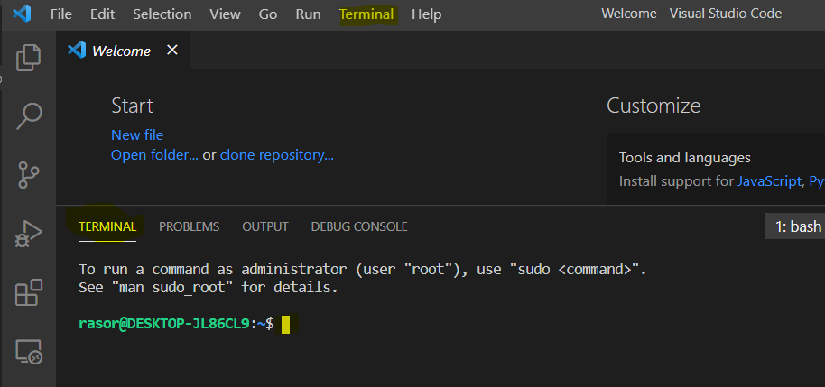

Title: Install apps on Ubuntu on Wsl2 in Windows 10
Status: published
Date: 2021-03-13 00:00
Modified: 2021-06-18 12:00
Category: DevOps
Tags: #ubuntu, #wsl2, #win10, #git, #ssh, #nvm, #nodejs

## Intro

This blog is a continuation from [Install Docker Desktop on Windows 10 Home - including WSL]({filename}/2020/2020-09-07-Docker4Win20.md), where I installed WSL2 on a Windows 10 laptop including [openSUSE-Leap-15-1](https://www.microsoft.com/da-dk/p/opensuse-leap-15-1/9njfzk00fgkv?rtc=1&activetab=pivot:overviewtab) as default distro in WSL2.  

In this blog I want to start using Ubuntu 20.04 and see if it gives an ok experience running Linux on Windows (and using it as a developer PC).  

If you have installed WSL2 and a default linux disto and in Visual Studio Code have installed [Remote WSL](https://marketplace.visualstudio.com/items?itemName=ms-vscode-remote.remote-wsl) then you should open Remote WSL and be able to see your default distro:  
  

## Install Linux distro

Now I want to use Ubuntu instead. 
[Get Ubuntu 20.04 LTS - Microsoft Store](https://www.microsoft.com/en-us/p/ubuntu-2004-lts/9n6svws3rx71?rtc=1&activetab=pivot:overviewtab)
  
Press `Get`. This will open `Microsoft Store` on your PC and yet again press `Get`. It will download 0.5 GB!  
When downloaded it will ask you to `Launch` or to `Pin to start`. When you Launch you start installing Ubuntu - you just follow the steps.  
  

Open CMD in your PC.  
Now you can see the Ubuntu running, but not default (*)
```bash
# CMD on Win10
wsl -l -v
#   NAME                   STATE           VERSION
# * openSUSE-Leap-15-1     Stopped         2
#   docker-desktop-data    Stopped         2
#   Ubuntu-20.04           Running         2
#   docker-desktop         Stopped         2

# Set Ubunto default
wsl --set-default Ubuntu-20.04
```
### Udate to WSL2

In case WSL Version 2 is not default then you need to download WSL2 update, set WSL2 default and finally change your distro to using WSL2.  

Verify that you are not running WSL2:

```bash
wsl -l -v
#   NAME            STATE           VERSION
# * Ubuntu-20.04    Stopped         1
```

* [Download the Linux kernel update package](https://docs.microsoft.com/en-us/windows/wsl/install-win10#step-4---download-the-linux-kernel-update-package) and install it.

```bash
# with Linux kernel update package installed
# Update your distro to WSL2
wsl --set-version Ubuntu-20.04 2

# wait a while.....

wsl -l -v
#   NAME            STATE           VERSION
# * Ubuntu-20.04    Stopped         2
```

### Using WSL from VSCode

You can see your WSL distros in VSCode  
  

Next you should right-click the distro and `Connect to WSL`.  
This will open up a new VSCode which is directly connected to your WSL, so you can browse its files, edit the files and run the terminal.  

## Install apps into the distro

### What's in the box?

Open a terminal. You will be in your home folder `~`.  

.  
Nice - so what's in the box?

```bash
# bash
# Do we have curl?
curl --version
# curl 7.68.0 (x86_64-pc-linux-gnu) libcurl/7.68.0 OpenSSL/1.1.1f zlib/1.2.11 brotli/1.0.7 libidn2/2.2.0 libpsl/0.21.0 (+libidn2/2.2.0) libssh/0.9.3/openssl/zlib nghttp2/1.40.0 librtmp/2.3

# Do we have wget?
wget --version
# GNU Wget 1.20.3 built on linux-gnu.

# Do we have git?
git --version
# git version 2.25.1

# update packages
sudo apt update

# Do we have python?
python3 -V
# Python 3.8.5
pip3 -V
# Command 'pip3' not found, but can be installed with:
# sudo apt install python3-pip
sudo apt install python3-pip
pip3 -V
# pip 20.0.2 from /usr/lib/python3/dist-packages/pip (python 3.8)
```

### xClip

A copy-paste tool  

* Used during Git config 

Install [xClip](https://www.cyberciti.biz/faq/xclip-linux-insert-files-command-output-intoclipboard/)
```bash
# bash
sudo apt-get install xclip
```

### Git

Though git is installed you'll probably want configuraions like SSH access to your github repo.

* Guides
    * [Connecting to GitHub with SSH](https://help.github.com/en/articles/connecting-to-github-with-ssh)
    * [Changing a remote URL](https://help.github.com/en/articles/changing-a-remotes-url#switching-remote-urls-from-https-to-ssh)

Optionally add some author info:

```bash
# bash
git config --global user.name "Your Name"
git config --global user.email "youremail@domain.com"
git config --list
# The information you entered is stored in your Git configuration file ~/.gitconfig
```

If you use 2FA on github, then SSH access with a private key avoids having a `Personal Access Token` to risk to loose and having to cache. More info on [Which remote URL should I use?](https://help.github.com/en/articles/which-remote-url-should-i-use#cloning-with-ssh-urls).  
So from VSCode rather like to use SSH access (opposed to HTTPS access).  
Since you can just regenerate a new SSH key pair, then you don't have to save your private key for later use.  

Warning: You should not give the SSH key a passphrase to avoid trouble in VSCode

* Ref: 
[Version Control in Visual Studio Code](https://code.visualstudio.com/docs/editor/versioncontrol#_can-i-use-ssh-git-authentication-with-vs-code)
* But you might get it working by [Storing SSH key passphrase in KDE Wallet](https://wiki.archlinux.org/index.php/KDE_Wallet#Using_the_KDE_Wallet_to_store_ssh_key_passphrases)

```bash
# bash
# Check for existing SSH keys
ls -al ~/.ssh
# Are there any you want to reuse?
# ls: cannot access '/home/rasor/.ssh': No such file or directory
mkdir ~/.ssh

# I want to generate a new key pair
cd ~/.ssh
ssh-keygen -t rsa -b 4096 -C "youremail@domain.com" -f id_rsa_youruserid_github
# Generating public/private rsa key pair.
# Enter file in which to save the key (/home/youruserid/.ssh/id_rsa): id_rsa_youruserid_github
# Enter passphrase (empty for no passphrase): 
# Enter same passphrase again: 
# Your identification has been saved in id_rsa_youruserid_github.
# Your public key has been saved in id_rsa_youruserid_github.pub.
# The key fingerprint is:
# SHA256:X4uMb123456789012345678901234567rWzWRZD1Szl youremail@domain.com
# The key's randomart image is:
# +---[RSA 4096]----+

# Avoid error "Can't clone git repo and getting error ssh_askpass: exec(/usr/bin/ssh-askpass): No such file or directory Host key verification failed"
# https://stackoverflow.com/questions/52711525/cant-clone-git-repo-and-getting-error-ssh-askpass-exec-usr-bin-ssh-askpass
ssh-keyscan -t rsa github.com >> ~/.ssh/known_hosts
# github.com:22 SSH-2.0-OpenSSH_7.2p2 Ubuntu-4ubuntu2.8
ssh-keyscan -t rsa gitlab.com >> ~/.ssh/known_hosts
ssh-keyscan -t rsa bitbucket.org >> ~/.ssh/known_hosts
ssh-keyscan -t rsa ssh.dev.azure.com >> ~/.ssh/known_hosts

# later on you will put your keys in a keychain - for that you need to install one
sudo apt install keychain
# vExtra info on [keychain...](https://www.funtoo.org/Keychain)
```

Now you are ready to use your keychain.  

```bash
# bash
cd ~/
touch ~/.bash_profile
```

In VSCode you can blowse to  ~/.bash_profile add your newly generated ssh key to the keychain whenever you open a terminal
```bash
# ~/.bash_profile
# Add your SSH key to SSH Agent
eval `keychain --eval --agents ssh id_rsa_youruserid_github`
# Now you don't have to add your SSH key to agent (`ssh-add`) before you commit to github.
```

Open a new terminal to make it take effect.

Add a new SSH key to your GitHub (bitbucket, gitlab, etc) account

```bash
# bash
# verify that keychain in installed
eval `keychain`
# * keychain 2.8.5 ~ http://www.funtoo.org
# * Starting ssh-agent...

# Copy the contents of the id_rsa_youruserid_github.pub file to your clipboard
xclip -sel clip < ~/.ssh/id_rsa_youruserid_github.pub
# Error: Can't open display: (null)
```

Hmm - xclip not working in WSL - then instead open the file ~/.ssh/id_rsa_youruserid_github.pub in VSCode and select-all and copy (ctrl-a ctrl-c).

* Goto [https://github.com/settings/keys](https://github.com/settings/keys)
    * or [bitbucket](https://bitbucket.org/account/user/your_userid/)
    * or [dev.azure](https://dev.azure.com/your_userid/_usersSettings/keys)
    * or [gitlab.com](https://gitlab.com/profile/keys)
* New SSH key
* Paste key: Ctrl-V
* Title: vscode_youruserid_github
* Save key: Add SSH key

Finally you need to change urls on your local repos remote origin from HTTPS to SSH

```bash
# bash
cd your_local_repo
# Print remote url
git remote -v
# is it using HTTPS?

# Change to SSH (get the SSH url from your remote repo on github)
git remote set-url origin git@github.com:USERNAME/REPOSITORY.git
# or if origin was removed:
git remote add origin git@github.com:USERNAME/REPOSITORY.git
# Print remote url
git remote -v
```

Troubleshooting github connection:

```bash
# bash
git clone git@github.com:USERNAME/REPOSITORY.git
# Cloning into 'REPOSITORY'...
# Warning: Permanently added the RSA host key for IP address '250.50.50.50' to the list of known hosts.
# git@github.com: Permission denied (publickey).
# fatal: Could not read from remote repository.

# hmmm - do we have our key in the keychain?
keychain --list
# Could not open a connection to your authentication agent.

# does not seem so.
# Try close VSCode - re-open VSCode and a terminal and retry
keychain --list
#v4096 SHA256:X4uMb123456789012345678901234567rWzWRZD1Szl youremail@aa.bb (RSA)

# Nice - try clone again
git clone git@github.com:USERNAME/REPOSITORY.git
# Cloning into 'REPOSITORY'...
# remote: Enumerating objects: 3, done.
# Receiving objects: 100% (3/3), done.
```

Now we can clone using the SSH key, then add a file, commit and try to see if you can push, too.

### NVM and NodeJs

* [nvm @ github](https://github.com/nvm-sh/nvm)

```bash
# bash
# Do we have nvm?
nvm -list
# Nope
curl -o- https://raw.githubusercontent.com/nvm-sh/nvm/v0.37.2/install.sh | bash
# => Appending nvm source string to /home/rasor/.bashrc
# => Appending bash_completion source string to /home/rasor/.bashrc
# internal/modules/cjs/loader.js:796
#     throw err;
#     ^

# Error: Cannot find module '\\wsl$\Ubuntu-20.04\mnt\c\Program Files\nodejs\node_modules\npm\bin\npm-cli.js'
#     at Function.Module._resolveFilename (internal/modules/cjs/loader.js:793:17)
#     at Function.Module._load (internal/modules/cjs/loader.js:686:27)
#     at Function.Module.runMain (internal/modules/cjs/loader.js:1043:10)
#     at internal/main/run_main_module.js:17:11 {
#   code: 'MODULE_NOT_FOUND',
#   requireStack: []
# }
# => Close and reopen your terminal to start using nvm or run the following to use it now:

# export NVM_DIR="$HOME/.nvm"
# [ -s "$NVM_DIR/nvm.sh" ] && \. "$NVM_DIR/nvm.sh"  # This loads nvm
# [ -s "$NVM_DIR/bash_completion" ] && \. "$NVM_DIR/bash_completion"  # This loads nvm bash_completion

# ..... something went wrong - but did it matter? Check if it added a NVM envir key:
printenv NVM_DIR
# /home/rasor/.nvm

# Now start yet a terminal and
nvm -list
#             N/A
# iojs -> N/A (default)
# node -> stable (-> N/A) (default)
# unstable -> N/A (default)

# nice - it is installed. Now install latest Node LTS - see https://nodejs.org/en/
nvm install 14.16.0
nvm list
# ->     v14.16.0
# default -> 14.16.0 (-> v14.16.0)
```

Great - now I have a fine start with git, python and nodejs in my Ubuntu box on Windows :-)

The End
