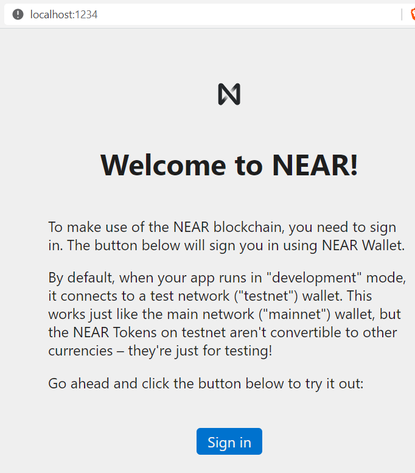
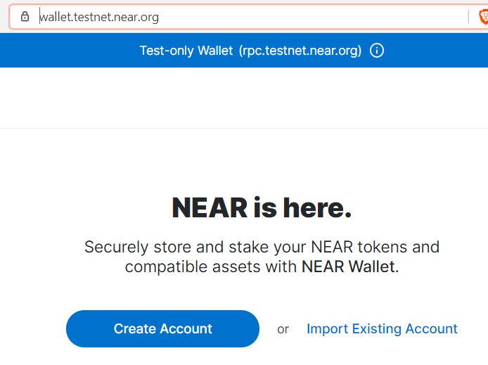
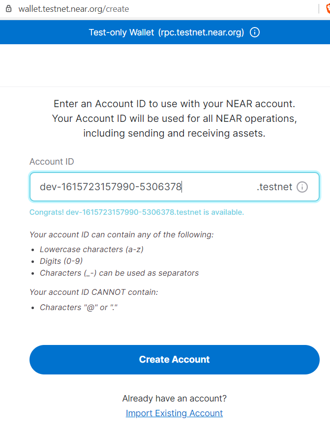
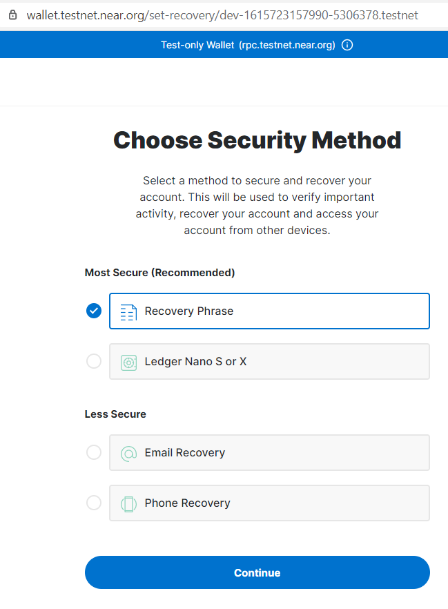
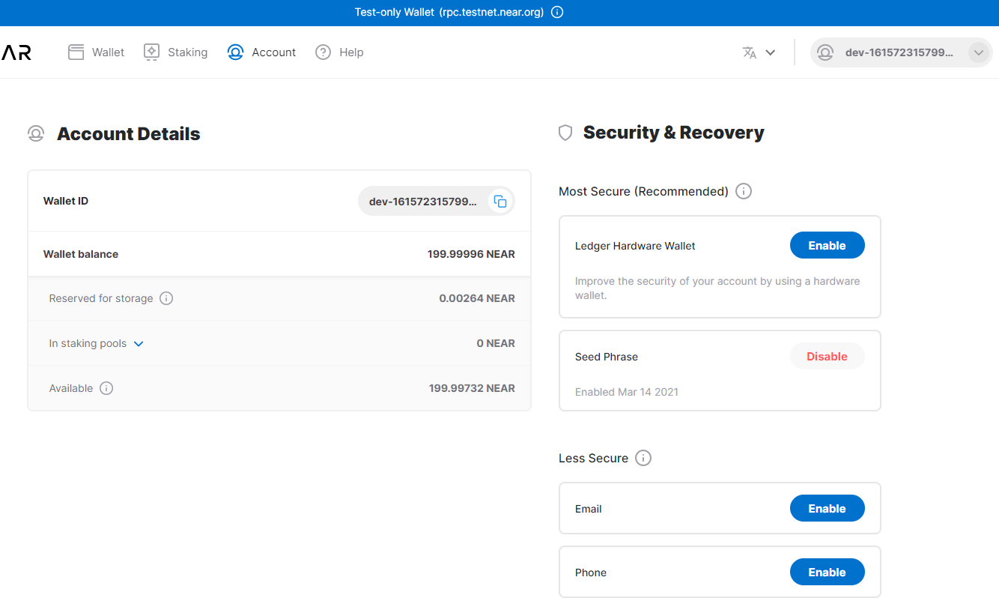

Title: Testing templates from NEAR blockchain
Status: published
Date: 2021-03-14 00:00
Modified: 2021-03-14 14:00
Category: Develop
Tags: #blockchain, #near, #npm

_(The code for this blog is located [here](https://github.com/rasor/near-app-default-react))_  

## Intro

For the blockcahin [NEAR protocol](https://docs.near.org/docs/develop/basics/getting-started) there is a npm starter template that makes it easy to start to write web-wallets that uses the blockchain.  

First I want to see the React template with AssemblyScript smart contract.  
There are two [options](https://github.com/near/create-near-app#readme) you can add:

* `--frontend=react` – use React for your frontend template (opposed to vanilla JS)
* `--contract=rust` – use Rust for your WebAssembly smart contract (opposed to [AssemblyScript](https://www.assemblyscript.org/))

I'll use the React option in this blog.  
Hang on and see what you get out of it!  

Before going on there is a quickfix you need todo if you are on Windows. 

### Avoid error "ln: EPERM: operation not permitted, symlink" on Windows

To avoid seeing err `ln: EPERM: operation not permitted, symlink` on windows:

```
ln: EPERM: operation not permitted, symlink '../contract/build/release/greeter.wasm' -> 'C:/Users/rasor/projs-git/projs-near/near_app_default_react/out/main.wasm'
```
... then you should [run CMD as admin](https://github.com/lovell/sharp/issues/1671#issuecomment-490023743)

### Install app

```bash
# bash - run as admin on windows

# Switch to node v12 (v14 is too new for fsevents@1)
nvm use 12.14.1

# Testing NEAR react template
# Using https://www.npmjs.com/package/create-near-app/v/1.3.6
npx create-near-app near-app-default-react --frontend=react
# npx: installed 75 in 15.801s
# Installing project dependencies...
# yarn install v1.22.10
# info No lockfile found.
# [1/4] Resolving packages...
# [2/4] Fetching packages...
# [3/4] Linking dependencies...
# [4/4] Building fresh packages...
# success Saved lockfile.

# > near-vm@1.1.0 preinstall C:\Users\rasor\projs-git\projs-near\near-app-default-react\contract\node_modules\near-vm
# > node ./uninstall.js
# > near-vm@1.1.0 postinstall C:\Users\rasor\projs-git\projs-near\near-app-default-react\contract\node_modules\near-vm
# > node ./install.js

# npm notice created a lockfile as package-lock.json. You should commit this file.
# npm WARN visitor-as@0.3.2 requires a peer of assemblyscript@^0.13.3 but none is installed. You must install peer dependencies yourself.

# added 105 packages from 86 contributors and audited 105 packages in 10.211s
# Success! Created near-app-default-react

# Inside that directory, you can run several commands:
#   yarn dev
#     Starts the development server. Both contract and client-side code will
#     auto-reload once you change source files.
#   yarn test
#     Starts the test runner.
#   yarn deploy
#     Deploys contract in permanent location (as configured in src/config.js).
#     Also deploys web frontend using GitHub Pages.
#     Consult with README.md for details on how to deploy and package.json for full list of commands.
# We suggest that you begin by typing:
#   cd near-app-default-react
#   yarn dev
# Happy hacking!
cd near-app-default-react
```

I have removed lots of what was output above.  
The script installed `yarn` if you did not yet have it and it also ran yarn install and created a `yarn-lock.json` file, which it later converted to a `package-lock.json` file.  

If you ran the script on Ubuntu it would have stayed a `yarn-lock` file.

Currently there are a few workarounds I had todo to make the web work.

### Avoding error "Invalid Version: undefined"

To avoid seeing err `Invalid Version: undefined`:

```bash
# details of the error:
> parcel build src/index.html --public-url ./
×  C:\Users\rasor\projs-git\projs-near\near-app-default-react\src\index.js: Invalid Version: undefined
```

... then we pin version of [parcel-bundler](https://github.com/parcel-bundler/parcel/issues/5943#issuecomment-788715242)  
from: `~1.12.4`  
to: `1.12.3`

... then do:
```bash
# bash
npm install parcel-bundler@1.12.3 --save-dev
```

### Avoid warn "requires a peer of assemblyscript"

To avoid seeing warn `requires a peer of assemblyscript`:

```bash
# details of the warn:
npm WARN visitor-as@0.3.2 requires a peer of assemblyscript@^0.13.3 but none is installed. You must install peer dependencies yourself.
```

... then do:
```bash
# bash
npm install assemblyscript@0.17.14 --save-dev
```

### Avoid warn "lifecycle The node binary used for scripts" on Ubuntu

To avoid seeing warn:
```bash
# details of the warn:
npm WARN lifecycle The node binary used for scripts is /tmp/yarn--1615665488049-0.7742038105254476/node but npm is using /home/rasor/.nvm/versions/node/v14.16.0/bin/node itself. Use the `--scripts-prepend-node-path` option to include the path for the node binary npm was executed with.
```

This happens if you are using nvm on Ubuntu, when running `yarn dev`, since the install script both installed yarn and node. It installed node another place than nvm did.  
So when the dev script executes it uses its own npm.  
One fix can be to install dependencies from yarn-lock - then create a package-lock - then use npm instead of yarn 

```bash
# bash
# Install dependencies from yarn-lock
yarn install
# Create a lock file for npm from node_modules
npm shrinkwrap
# Rename the created file to package-lock
mv npm-shrinkwrap.json package-lock.json
# ... so now we can use npm instead of yarn
```

### Build and Run

```bash
# bash - run as admin on windows
# install reamining dependencies
npm install
# Build
npm run build

# Run
npm run dev
# > near-app-default-react@0.1.0 dev C:\Users\rasor\projs-git\projs-near\near-app-default-react
# > nodemon --watch contract -e ts --exec "npm run start"
# [nodemon] starting `npm run start`
# > near-app-default-react@0.1.0 prestart C:\Users\rasor\projs-git\projs-near\near-app-default-react
# > npm run build:contract:debug && npm run dev:deploy:contract
# > near-app-default-react@0.1.0 build:contract:debug C:\Users\rasor\projs-git\projs-near\near-app-default-react
# > node contract/compile.js --debug
# > greeter@0.0.1 build:debug C:\Users\rasor\projs-git\projs-near\near-app-default-react\contract
# > asb --target debug
# > near-app-default-react@0.1.0 dev:deploy:contract C:\Users\rasor\projs-git\projs-near\near-app-default-react
# > near dev-deploy

# Starting deployment. Account id: dev-1615723157990-5306378, node: https://rpc.testnet.near.org, helper: https://helper.testnet.near.org, file: ./out/main.wasm
# Transaction Id HezJKn5ZpiD2axYBoki5bjJSdUJuZJmZfJT6V6NWDb95
# To see the transaction in the transaction explorer, please open this url in your browser
# https://explorer.testnet.near.org/transactions/HezJKn5ZpiD2axYBoki5bjJSdUJuZJmZfJT6V6NWDb95
# Done deploying to dev-1615723157990-5306378

# > near-app-default-react@0.1.0 start C:\Users\rasor\projs-git\projs-near\near-app-default-react
# > echo The app is starting! It will automatically open in your browser when ready && env-cmd -f ./neardev/dev-account.env parcel src/index.html --open

# The app is starting! It will automatically open in your browser when ready
# Server running at http://localhost:1234
# √  Built in 9.75s.
```

The web created a transaction that you can see on the [transaction explorer](https://explorer.testnet.near.org/transactions/HezJKn5ZpiD2axYBoki5bjJSdUJuZJmZfJT6V6NWDb95) meaning the webapp is controlling a wallet and its private key, which was used to sign that transaction.  
My signer-id was `dev-1615723157990-5306378`. I'll use that later, when creating an [account](https://docs.near.org/docs/concepts/account).  
What the script did was it deployed the smart contract (found in `contract\assembly\index.ts`) in that transaction.  

The dev script also opened the web in a browser:  
  

Clicking on `Sign In` redirects to external `testnet` site:  
  
It wants you to create an account. Click on `Create Account`  

Now re-use your signer-id:  
  
and press `Create Account`

Now you will have to choose recovery mode:  
  
Just continue with Recovery Phrase and write down the 12 word seed on the follwing page.

Lastly you are redirected to your [NEAR Wallet](https://wallet.testnet.near.org/profile) page on the testnet:
  

So what you have is a wallet webapp containing the private key to do transactions on the near blockchain.  
As you can see you could also have chosen to use a Ledger as a HW device for your private key.  

When you look on you disk you'll find

* `<HOME>\.near-config\` - containing session config
* `<HOME>\.near-credentials\testnet\` - containing public key and private key. So remember to include a backup strategy for that.  
* `src\config.js` - containing links to different NEAR networks (e.g. testnet, mainnet).  

When you build **for dev**, then it will use **testnet**! - and **for prod** then **mainnet**.  

### .gitignore

.gitignore is missing some folders it should ignore. You can add:

```bash
# .gitignore
/contract/node_modules
/contract/build
/.cache
/dist
```

## Links

* Community: [Join the NEAR Discord Server!](https://discord.com/invite/UY9Xf2k)
* JS API
    * [Sign Transactions · NEAR Documentation](https://docs.near.org/docs/tutorials/create-transactions#sign-transaction)
    * [class SignedTransaction](https://github.com/near/near-api-js/blob/d4d4cf1ac3182fa998b1e004e6782219325a641b/src/transaction.ts#L112-L123)
* [Borsh](https://borsh.io/)

The End
