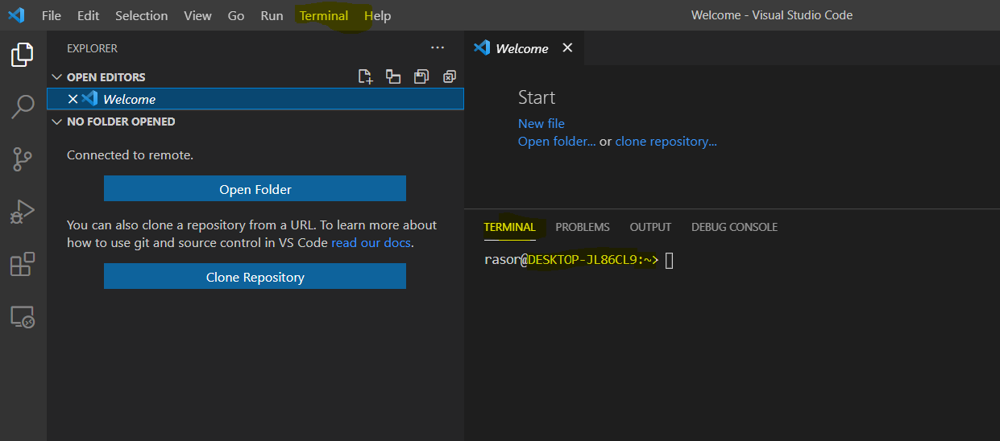

Title: Install apps on OpenSuse on Wsl2 in Windows 10
Date: 2099-01-01 00:00
Modified: 2099-01-01 00:00
Category: DevOps
Tags: #opensuse, #wsl2, #win10

This blog is a continuation from [Install Docker Desktop on Windows 10 Home - including WSL]({filename}/2020/2020-09-07-Docker4Win20.md), where I installed WSL2 on a Windows 10 laptop including [openSUSE-Leap-15-1](https://www.microsoft.com/da-dk/p/opensuse-leap-15-1/9njfzk00fgkv?rtc=1&activetab=pivot:overviewtab) as default distro in WSL2.  

In this blog I want to start using OpenSuse and see if it gives an ok experience running Linux on Windows.  

If you have installed WSL2 and a default linux disto and in Visual Studio Code have installed [Remote WSL](https://marketplace.visualstudio.com/items?itemName=ms-vscode-remote.remote-wsl) then you should open Remote WSL and be able to see your default distro:
.  

Next you should right-click the distro and `Connect to WSL`.  
Then open a terminal. You will be in your home folder `~`.  
.  
Nice - so now you can install stuff:

```bash
# Do we have curl?
curl --version
# curl 7.60.0 (x86_64-suse-linux-gnu) libcurl/7.60.0 OpenSSL/1.1.0i zlib/1.2.11 libidn2/2.0.4 libpsl/0.20.1 (+libidn2/2.0.4) libssh/0.8.4/openssl/zlib nghttp2/1.31.1

# Do we have wget?
wget --version
# GNU Wget 1.19.5 built on linux-gnu.

# Do we have git?
git --version
#git version 2.16.4


# Do we have nvm?
# https://github.com/nvm-sh/nvm
nvm -list
# Nope
curl -o- https://raw.githubusercontent.com/nvm-sh/nvm/v0.37.2/install.sh | bash
# Something fails with this command - and it opens an editor in the terminal - kill the terminal
# It does download nvm to ~/nvm
# But it does not add envir var
printenv NVM_DIR
# Also the distro does not have a ~/.bash_profile
```

I think I should try an Ubunto distro instead

The End
